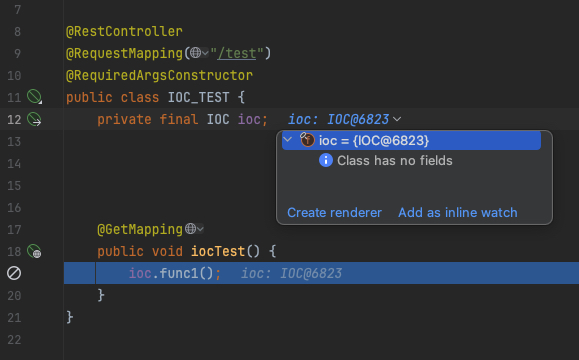
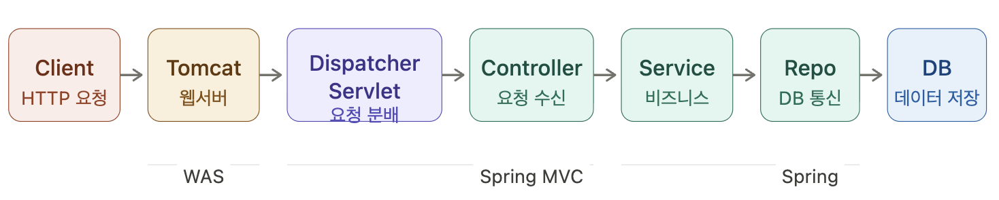
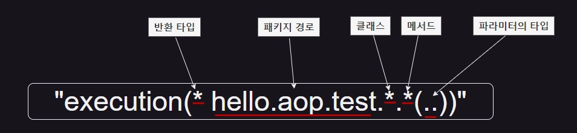

# 0318(수) - Spring과 AOP

---

## 1. IoC (Inversion of Control, 제어의 역전)

객체는 JVM Heap 메모리에 생성된다. `new`로 객체를 직접 생성하면 아래 문제가 발생한다.

- **OOM (Out of Heap Memory)**: 객체가 계속 쌓이면 메모리 부족
- **결합도 증가**: 클래스 간 의존이 강해져 수정이 어려움
- **생성 순서 관리 어려움**: 의존하는 객체를 먼저 만들어야 하는데 순서 파악이 복잡

_**⇒ IoC로 이를 해결한다.**_

### IoC

> 객체를 개발자가 직접 `new`로 만들지 않고, Spring 컨테이너가 생성·관리하게 위임하는 것

- 객체를 Bean으로 등록하면 컨테이너가 딱 한 번만 만들어 관리한다.

### Bean

> Bean으로 등록된 객체는 생성과 관리를 Spring이 담당한다.

어노테이션으로 Bean에 등록할 수 있다.

```java
@Component           // 클래스를 Bean으로 등록 (일반 컴포넌트)
@Service             // @Component + 비즈니스 계층임을 명시
@Repository          // @Component + DB 계층임을 명시
@RestController      // @Component + HTTP 요청 처리
@RequiredArgsConstructor  // 생성자 주입 자동화 (Lombok)
@Bean                // 클래스가 아닌 메서드 단위에 사용 (외부 라이브러리 등록 시)
```

> `@Service`, `@Repository`, `@RestController`는 내부적으로 `@Component`를 포함한다.

- 디버깅 모드에서 같은 객체임을 확인할 수 있다.

  

- IoC 컨테이너에 등록되고, 객체는 단 하나만 생성된다. → 싱글톤 패턴

  

### IoC 순서
```
앱 실행 → @ComponentScan 수행 → 클래스 스캔 → 객체 생성(싱글톤) → IoC 컨테이너 저장(JVM Heap) → DI로 주입
```

---

## 2. DI (Dependency Injection)

> Spring은 IoC를 DI 방식으로 구현한다.

- **IoC**: 추상적인 원칙 ("제어를 역전해라")
- **DI**: IoC를 실현하는 구체적인 패턴 ("의존성을 주입해라")
- **IoC Container**: DI 패턴을 실제로 구현해주는 Spring의 도구

### DI 구현방법(3가지)

1. **필드 주입** (잘 안 씀 - 순환 참조 감지 어려움, 테스트 불편)
    ```java
    @Autowired
    private IOC ioc;
    ```
2. **Setter 주입** (잘 안 씀 - 불변성 보장 안 됨)
    ```java
    @Autowired
    public void setIoc(IOC ioc) {
      this.ioc = ioc;
    }
    ```

3. **생성자 주입** ✅ (권장 - 불변성 보장, 순환 참조 시 앱 실행 시점에 바로 오류 감지)
    ```java
    private final IOC ioc;
   
    public void IOC(IOC ioc) {
      this.ioc=ioc;
    }
    ```

4. **`@RequiredArgsConstructor`로 간략화** (Lombok)
    ```java
    // 위 생성자 주입과 동일한 동작
    @RequiredArgsConstructor
    public class IOC_TEST {
      private final IOC ioc; // final 필드만 자동으로 생성자에 포함됨
    }
    ```

### 순환 참조 문제
클래스 A가 B를 필요로 하고, B가 A를 필요로 할 때 발생한다.
```java
@Component class A { A(B b) {} }  // A는 B가 필요
@Component class B { B(A a) {} }  // B는 A가 필요
// → Spring 시작 시 오류 발생
```
- **생성자 주입**을 사용하면 앱 실행 시점에 즉시 오류를 던져 빠르게 감지할 수 있다.

---

## 3. IoC 컨테이너

| 컨테이너 | 설명                                                       |
|---|----------------------------------------------------------|
| **BeanFactory** | 기본 컨테이너. Bean 생성·조회만 담당. **JVM Heap에 Bean 보관**           |
| **ApplicationContext** | BeanFactory를 상속. 국제화·이벤트·환경변수·리소스 로딩 등 부가 기능 포함. 실무에서 사용 |

> Spring Boot는 내부적으로 `AnnotationConfigApplicationContext`를 사용한다.

---

## 4. 스프링 MVC 구조
> Model-View-Controller 패턴 기반의 웹 요청 처리 구조

### 호출 순서

```
Client → Tomcat(WAS) → DispatcherServlet → Controller → Service → Repo → DB
```



### 각 계층 역할

| 계층 | 역할 |
|---|---|
| **Tomcat** | HTTP 요청 수신, HttpServletRequest로 변환 |
| **DispatcherServlet** | URL에 맞는 Controller로 요청 분배 (Front Controller 패턴) |
| **Controller** | 요청 수신, 파라미터 검증, Service 호출 |
| **Service** | 핵심 비즈니스 로직 처리 |
| **Repository** | DB와 통신 (저장, 조회, 수정, 삭제) |

### Tomcat
WAS(Web Application Server)의 한 종류.

> **Web Server vs WAS**: 웹서버(Nginx 등)는 정적 파일(HTML, CSS, 이미지)만 처리. WAS는 동적 처리(Java 코드 실행, DB 연동)까지 담당.

Tomcat의 처리 흐름:

1. 포트(8080) 리스닝 → 요청 대기
2. HTTP 요청 → `HttpServletRequest` 객체로 변환
3. DispatcherServlet 호출 → Spring으로 전달
4. Spring 처리 결과 → HTTP 응답으로 변환 후 클라이언트에 반환

---

## 5. AOP (Aspect-Oriented Programming)
> 핵심 비즈니스 로직과, 여러 곳에 반복되는 부가 로직(로깅, 트랜잭션, 인증 등)을 분리해서 관리하는 기법

### AOP는 프록시 기반
> **프록시** = 실제 객체 대신 앞에서 가로채는 대리 객체. GoF 디자인 패턴 중 하나.

| 적용 대상 | 예시 |
|---|---|
| 객체 | Spring AOP, `@Transactional` |
| 네트워크 | 프록시 서버, VPN |
| 보안 | 방화벽 |

- **메서드 호출 흐름**: 프록시 → 인터셉터 체인 → 실체 객체
  ```
  Proxy.createMember()
  ↓
  TransactionInterceptor.invoke()
  ↓
  PlatformTransactionManager.begin()   ← 트랜잭션 시작
  ↓
  실제 createMember()
  ↓
  commit or rollback
  ```

### AOP 문법
[LogAspect.java](../my_api_server/src/main/java/com/example/my_api_server/config/LogAspect.java)



반환 타입, 패키지 경로, 클래스, 메서드, 파라미터 타입을 지정할 수 있다.

`build.gradle` dependencies에 추가 (Spring Boot v4.0.3):

```gradle
implementation 'org.springframework.boot:spring-boot-starter-aspectj'
```

---


## 6. 트랜잭션

## 트랜잭션

### ACID 4가지 특징

| 특징 | 설명 |
|---|---|
| **Atomicity** (원자성) | 전부 성공하거나 전부 실패 |
| **Consistency** (일관성) | 트랜잭션 전후 데이터 무결성 유지 |
| **Isolation** (격리성) | 동시 실행돼도 서로 영향 최소화 |
| **Durability** (지속성) | 성공한 데이터는 영구 저장 |


### `@Transactional`

AOP(프록시) 방식으로 동작한다. `BEGIN TRAN`, `COMMIT`, `ROLLBACK`을 자동 처리.

```java
@Transactional
public Long signUp(String email, String password) {
    // 예외 발생 시 자동 rollback
    // 정상 종료 시 자동 commit
}
```

### 선언적 vs 명시적

| 방식 | 사용법 | 특징 |
|---|---|---|
| **선언적** | `@Transactional` | 간단, 실무에서 주로 사용 |
| **명시적** | `PlatformTransactionManager`, `TransactionTemplate` | 세밀한 제어 필요할 때 |

### ⚠️ 주의사항

- **같은 클래스 내부 호출**: 중첩이 안 된다.
- **Checked Exception**: 기본적으로 rollback하지 않는다. 설정 필요:
  ```java
  @Transactional(rollbackFor = Exception.class)
  ```
- **RuntimeException**: 기본적으로 rollback 된다.

---

### a) Record와 DI

- `record`는 Bean으로 등록하지 않는다.
- 요청마다 Jackson이 생성자를 호출해 객체를 만들고, 메서드가 끝나면 참조가 사라져 GC가 수거한다.
- IoC/DI와 무관하게 **데이터 전달 용도(DTO)** 로만 사용한다.

```java
public record SignUpRequest(String email, String password) {}
// getter, 생성자, equals, hashCode, toString 자동 생성
```
### b) 인터셉터 체인 순서 보장

- `@Order`로 우선순위 지정. 숫자가 낮을수록 바깥 레이어(먼저 실행).
```java
@Aspect @Order(1) public class AuthAspect { }
@Aspect @Order(2) public class LogAspect { }
@Aspect @Order(3) public class TransactionAspect { }
```
```
요청 → Auth → Log → Transaction → 실제 메서드 → Transaction → Log → Auth → 응답
```