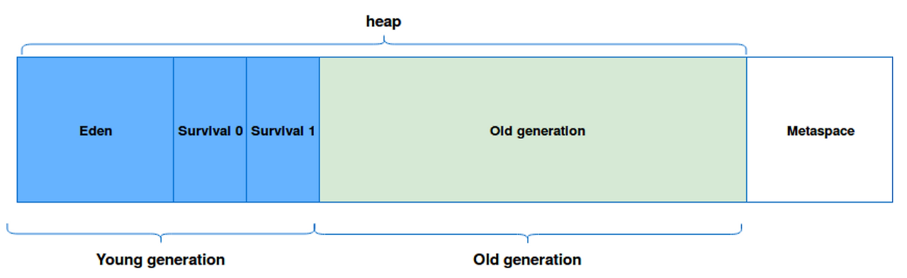
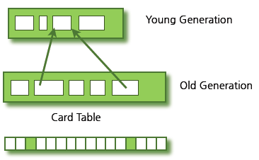
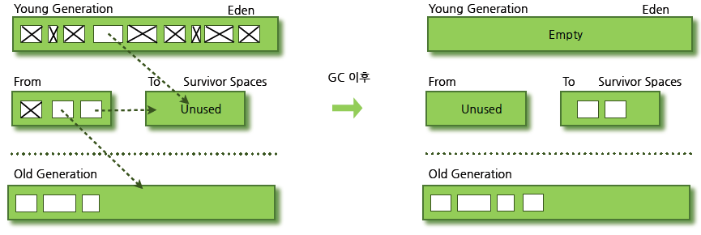
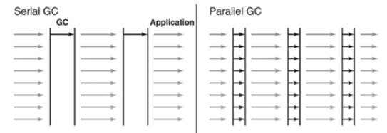
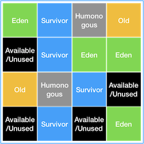
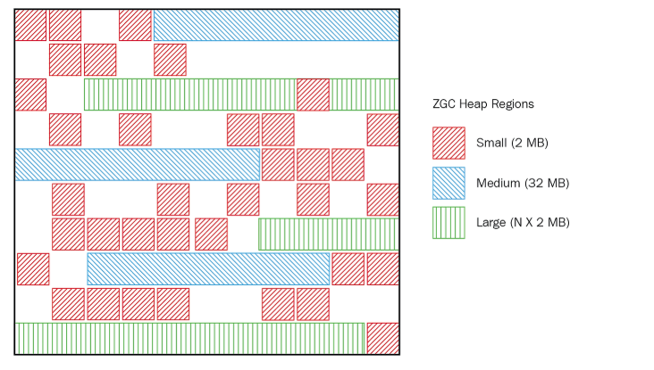

# Garbage Collection

Java의 메모리 관리 기법. 동적으로 할당했던 메모리 영역을 정리해준다. 다양한 알고리즘으로 구현된다.

---

## 1. Young 영역과 Old 영역

### a) weak generational hypothesis — GC를 설계할 때 2가지 전제 조건

1. 대부분의 객체는 금방 접근 불가능 상태(unreachable)가 된다.
2. 오래된 객체에서 젊은 객체로의 참조는 아주 적게 존재한다.

 

### **b) 생존 기간에 따라 물리적인 Heap 영역을 나눴다**

- Young Generation
    - 새롭게 생성된 객체가 할당되는 영역
    - 1번의 전제 발생. 많은 객체가 Young 영역에 생성되었다가 사라진다.
    - 본 영역의 GC를 **Minor GC**라고 부른다.
- Old Generation
    - Young 영역에서 Reachable 상태를 유지하여 살아남은 객체가 복사되는 영역
    - Young 영역보다 수명이 긴 객체들이 들어오기에 크기가 크다. 큰 만큼 GC는 적게 발생
    - 본 영역의 GC를 **Major GC**라고 부른다.

 

### c) Card Table

보통 Young → Old로 이동되지만, 가끔 Old → Young으로 참조가 필요할 때가 있다. 이를 위해 카드 테이블(Card Table)이 존재한다.

조회할 때마다 Card Table에 그에 대한 정보가 표시된다. GC는 카드 테이블을 조회해 정리 대상인지 판별할 수 있다.(카드 테이블에 없는 young이 GC 대상)

 

---

## 2. GC의 동작방식

### a) Stop-The-World

GC를 실행할 때 JVM이 일시 중단된다. GC를 실행하는 스레드 외의 스레드는 모두 작업을 멈추게 하고, 스택의 모든 변수 또는 Rechable 객체를 스캔하면서 어떤 객체를 참고하고 있는지 탐색한다.

GC의 종류에 따라 STW의 기간이 다르지만, 무조건 발생한다는 것은 변함없다. GC튜닝이란 대개 STW 튜닝을 말한다.

- G1: 일부 단계에서 STW 발생
- ZGC: STW 10ms 미만

 

### b) Mark and Sweep

STW 기간동안 Mark and Sweep을 진행한다.

- Mark: 사용되는 메모리와 사용되지 않는 메모리 식별하는 작업
- Sweep: Mark 단계후, 사용되지 않는 메모리 해제하는 작업

 

### c) Minor GC

Young 영역에서 일어나는 GC. Young 영역은 3가지 영역으로 나뉜다.

- Eden: 새로 생성한 대부분의 객체가 위치하는 곳
- Survivor 1: Eden에서 GC가 한 번 발생한 후 살아남은 객체가 이동하는 곳
- Survivor 2: 위 Survivor 영역이 가득 차게 되면 그중 살아남은 객체가 이동하는 곳. 가득찬 Survivor 영역은 아무 데이터도 없는 상태로 전환

위 과정을 반복해도 살아남은 객체는 Old 영역으로 넘어간다.

 

#### Old로 넘기는 기준 — Age:

생존 횟수를 age라고 하며, 이는 Object Header에 기록된다. 이를 통해 Old 영역으로 보낼지 말지 결정된다.

> ***Eden 영역에 할당은 어떻게 할까?*** HotSpot JVM에서는 Eden 영역에 마지막으로 할당된 객체의 주소를 캐싱하는 bump the pointer와 멀티스레드 환경에서 Lock을 제어해주는 TLABs(Thread-Local Allocation Buffers) 기술을 활용해 객체를 빠르게 할당할 수 있게끔 한다.

 

### c) Major GC

기본적으로 데이터가 가득 차면 GC를 실행한다. GC 방식에 따라 처리 절차가 다르다. Minor GC보다 훨씬 시간이 많이 걸린다.

 

---

## 3. GC 알고리즘

### a) Serial GC

Mark-Sweep-Compact 까지 나아가는 것

- Compact: 각 객체들이 연속되게 쌓이도록 힙의 가장 앞 부분부터 채우는 것. 객체가 존재하는 부분/존재하지 않는 부분으로 나눈다.
- **적합한 곳:** 적은 메모리와 CPU 코어 개수가 적을 때(실무에서 사용하는 경우가 보통 없다)

 

### b) Parallel GC(Java 8 default)

Serial과 기본적인 알고리즘은 같다. 여기서는 GC를 처리하는 스레드를 여러 개 사용한다.

- Serial GC에 비해 STW 시간 감소
- **적합한 곳:** 충분한 메모리와 CPU 코어 개수가 많을 때

 

### c) Parallel Old GC

JDK 5 update 6부터 제공한 방식. Mark-Summary-Compacation 단계를 거친다.

- Mark: 살아있는 객체 표시. Old 영역을 여러 Region으로 나눠 병렬로 수행
- Summary: 각 Region의 밀도(살아있는 객체 비율) 계산. 왼쪽부터 오른쪽으로 스캔하여 Compaction할 가치가 없는 밀도 높은 구간(dense prefix)을 판별
- Compaction: Summary에서 결정된 Region을 정리. 살아있는 객체를 왼쪽으로 모아 연속된 빈 공간 확보

 

### d) CMS GC(사용 중단)

여러 개의 스레드를 사용하지만, Mark Sweep 알고리즘을 Concurrent하게 수행한다.

- Initial Mark: 클래스 로더에서 가장 가까운 객체 중 살아있는 객체만 찾고 끝낸다. → 멈추는 시간이 굉장히 짧다
- Concurrent Mark: 방금 살아있다고 확인한 객체에서 참조하고 있는 객체들을 따라가면서 확인. 다른 스레드가 실행 중인 상태에서 동시에 진행된다.
- Remark: Concurrent Mark 단계에서 새로 추가되거나 참조가 끊긴 객체를 확인
- Concurrent Sweep: 쓰레기 정리. 이 작업도 다른 스레드가 실행되고 있는 상황에서 진행

⇒ STW 시간이 매우 짧지만 Compaction 단계를 기본적으로 제공하지 않는다. 메모리와 CPU 사용량도 높다. Java9 버전부터 deprecated되고 Java14에서는 사용이 중단됐다.

 

### e) G1 GC(동적 할당)

물리적으로 메모리 공간을 나누지 않고, Region으로 Heap을 균등하게 나눈다.

- 각 지역을 역할과 함께 논리적으로 구분한다. (Eden, Survivor, Old)
- 역할 2가지
    - humongous: Region 크기의 50%를 초과하는 객체를 저장하는 Region
    - Available/Unused: 사용되지 않은 Region
- 가비지가 많은 Region에 대해 우선적으로 GC 수행

4GB 이상의 Heap 메모리가 필요하다. STW 시간이 0.5초 정도 필요한 상황에 사용한다.

 

#### Minor GC:

- Eden 지역에서 GC가 수행되면 살아남은 객체를 Mark하고 Sweep한다.
- 살아남은 객체를 다른 지역으로 이동 시킬 때, Available/Unused 지역이면 Srvivor영역이 된다.
- Eden 영역은 Available/Unused 영역이 된다.

-  

#### Major GC(Full GC):

다른 GC는 모든 Heap 영역에서 GC가 처리됐지만, G1 GC는 지역에 대해서만 GC를 수행한다 → 애플리케이션의 지연을 최소화 할 수 있다.

 

### f) ZGC

대량의 메모리를 low-latency로 처리한다. 

- G1의 Region처럼 ZPage라는 영역을 사용
- G1 Region은 크기가 고정인데 비해, ZPage는 2mb 배수로 동적 운영
- **STW 시간이 절대 10ms를 넘지 않음**

---

> 참고
> 1. https://mangkyu.tistory.com/118
> 2. https://mangkyu.tistory.com/119
> 3. https://d2.naver.com/helloworld/1329