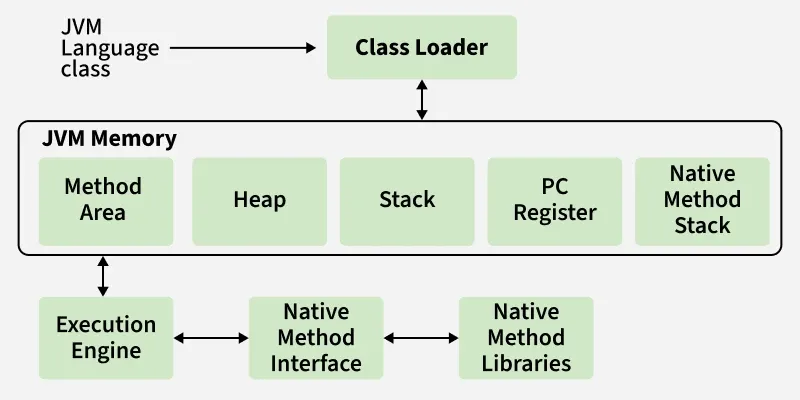

# JVM

---

## 1. JVM (Java Virtual Machine)

### a) JVM의 탄생과 의의

JVM 이전에는 OS와 Hardware에 맞는 컴파일을 플랫폼마다 따로 해야 했다.

JVM은 Bytecode라는 중간언어를 한 번만 만들어 각 플랫폼의 기계어로 해석해 실행한다.

1. `javac` 컴파일: `.java` → Bytecode(`.class`) — JVM이 이해하는 중간언어
2. `jar` 패키징: `.class` 묶어서 `.jar` 생성
3. `JVM` 해석: Bytecode → 현재 플랫폼 기계어로 변환 후 실행

**비교 — GO 언어**: 플랫폼 수만큼 빌드 필요

```
1. 개발 완료 및 AMD 빌드  → GOOS=linux GOARCH=amd64 go build → server_amd64 생성
2. ARM 서버로 교체, ARM용 재빌드 → GOOS=linux GOARCH=arm64 go build → server_arm64 생성
3. 코드 수정 → 배포 타겟 플랫폼 수만큼 빌드 → 각각 배포
```

**비교 — JVM**: `.jar` 1번 빌드로 충분

```
1. 개발 완료 및 빌드 → ./gradlew build → app.jar 생성
2. ARM 서버로 교체, 재빌드 X → app.jar 그대로 복사 → java -jar app.jar → 완료
3. 코드 수정 → ./gradlew build → app.jar 하나 교체 → 완료
```

> Docker는 이미지 안에 JVM을 포함하기 때문에, 이미지 자체를 플랫폼별로 따로 빌드해야 한다.

<br>

### b) JVM 구현체

JVM은 스펙(사양)이고, 구현체는 여러 개다. 해석 방식에서 차이가 있다.

- **JVM 스펙**: Oracle이 정의한 명세
- **구현체**: HotSpot, OpenJ9, GraalVM 등

```
일반적인 서버       → HotSpot
메모리 제약 환경    → OpenJ9
빠른 시작 속도 필요 → GraalVM
```

---

## 2. JVM 내부 구조



1. **Class Loader**: `.class` 파일 읽어 JVM Memory에 올림. Loading → Linking → Initialization
2. **JVM Memory (Runtime Data Areas)**: JVM이 사용하는 독립된 메모리 영역
3. **Execution Engine**: Bytecode 실행. Interpreter + JIT + GC로 구성
4. **JNI (Java Native Interface)**: C/C++ 네이티브 라이브러리 ↔ JVM 연결
5. **Native Method Libraries**: JNI를 통해 실행되는 실제 네이티브 라이브러리 모음

<br>

### a) ClassLoader

**Loading**: `.class` 읽고 JVM Memory에 저장
- Method Area: 클래스 메타정보
- Heap: 클래스당 Class 객체 1개 생성

**Linking**: 로드된 클래스를 실행 가능한 상태로 준비
- Verification: Bytecode가 JVM 규칙을 따르는지 검증
- Preparation: static 변수 메모리 할당 + 기본값 부여 (`0`, `false`, `null`)
- Resolution: 심볼릭 참조 → 실제 메모리 참조로 변환

> **심볼릭 참조**: `javac` 컴파일 시점에는 실제 메모리 주소를 알 수 없어, `.class` 파일 안에 `"com.example.Member"` 같은 문자열 이름으로 저장해두는 것

**Initialization**: static 변수에 실제 값 할당, static 블록 실행

<br>

### b) JVM Memory

JVM 프로세스마다 독립적으로 갖는 메모리 영역.

```
Thread Shared:
├── Method Area  : 클래스 메타정보, static 변수
└── Heap         : 객체, 배열

Thread Private:
├── Stack              : Java 메서드 Frame
├── PC Register        : 현재 실행 명령어 주소
└── Native Method Stack: 네이티브 메서드 Frame
```

**Method Area — Thread Shared**

모든 스레드 공유, JVM 시작 시 생성. 저장 데이터:
- 클래스 메타정보 (클래스/인터페이스/필드/메서드/생성자 Bytecode 정보)
- 상수 풀(Constant Pool): 문자열, 숫자 상수
- static 변수
- JIT 캐시 (Code Cache)

OS 메모리 초과 방지를 위해 **Metaspace** 영역으로 동적 확장.

**Heap — Thread Shared**

모든 스레드 공유, JVM 시작 시 생성. `new`로 생성되는 모든 객체·배열 저장. GC 대상.

GC 효율을 위해 세대 구분:
- Young Generation: 새 객체. 수명 짧은 객체 빠르게 GC
- Old Generation: Young에서 오래 살아남은 객체

**Stack — Thread Private**

스레드마다 독립 생성. 메서드 호출마다 **스택 프레임(Stack Frame)** push, 완료 시 pop. LIFO.
- 프레임 내용: 지역 변수, 매개변수, 리턴 주소

`StackOverflowError` 발생 가능 → 재귀 탈출 조건 주의

**PC Register — Thread Private**

스레드마다 하나. 현재 실행 중인 명령어 주소 저장.

**Native Method Stack**

JNI로 호출된 네이티브 메서드(C/C++)의 스택 프레임 저장.

<br>

### c) Execution Engine

`.class` 파일을 각종 메모리에서 읽어 실행한다.

**Interpreter**: Bytecode를 한 줄씩 번역·실행. 동일 코드도 매번 번역 → 비효율

**JIT (Just-In-Time Compiler)**: Interpreter 보완. 자주 실행되는 Bytecode 전체를 컴파일해 캐시 저장 → 이후 캐시에서 바로 제공

**Garbage Collector**: 더 이상 참조되지 않는 객체 자동 제거

> 참고: [GeeksforGeeks - How JVM Works (JVM Architecture)](https://www.geeksforgeeks.org/java/how-jvm-works-jvm-architecture/)

<br>

#### 전체 실행 흐름

1. 자바 프로그램 실행 → 독립적인 JVM 프로세스 생성
2. OS로부터 메모리 할당 → `ClassLoader`가 Bytecode 읽어 메모리에 올림
3. Interpreter / JIT가 Bytecode → 기계어(Native Machine Code)로 변환
4. 기계어가 RAM 특정 주소에 전기적 신호(0, 1)로 저장
5. CPU의 PC 레지스터가 주소를 가리키면 해당 기계어 묶음을 가져와 실행
