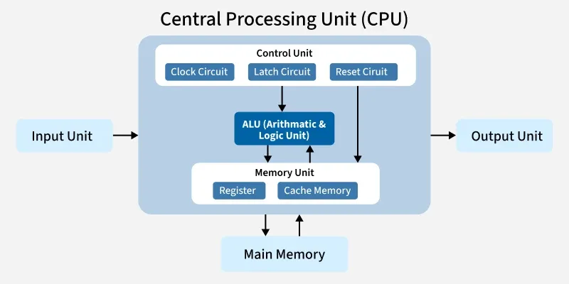
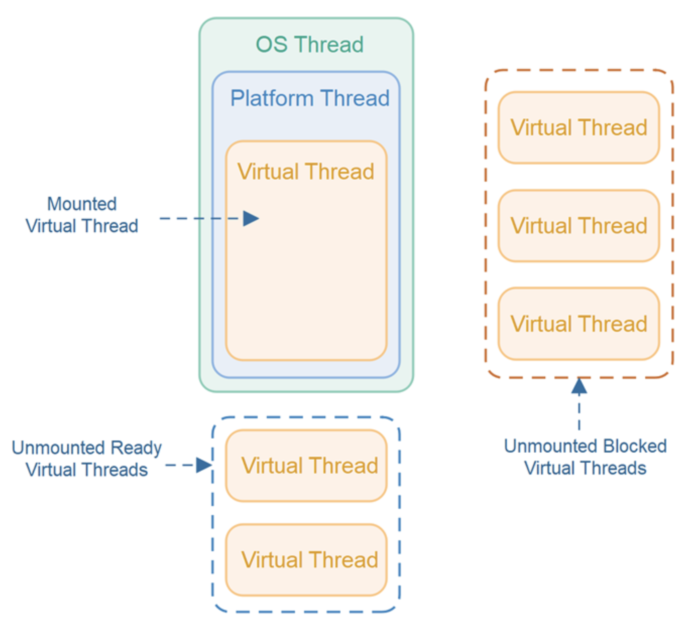
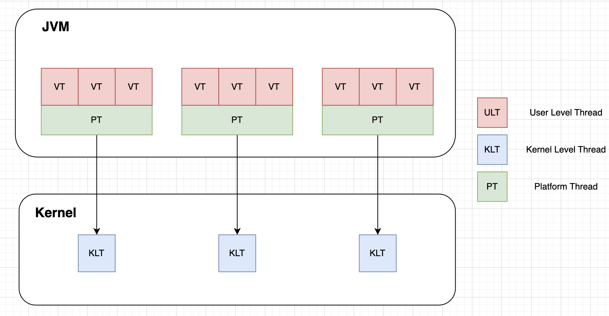

# Thread

## 1. CPU

내부에 ALU, Control Unit, Register, Cache. RAM → Cache → Register → ALU 순으로 데이터가 이동하며, ALU에서 실제 연산이 이뤄진다.



<br>

### a) Cache

지역성 기반으로 곧 쓸 데이터를 미리 올려둔다. → Cache Hit Rate 향상

- **지역성**: 시간 지역성(같은 데이터 반복 접근), 공간 지역성(인접한 데이터 순서대로 접근)
- **Cache Hit Rate** = Cache Hit 횟수 / 전체 접근 횟수
  - Cache Hit: 필요한 데이터가 캐시에 있음 → RAM 접근 불필요
  - Cache Miss: 없음 → RAM 접근
- 데이터가 올라가는 공간: **L1, L2, L3**
  - 숫자가 작을수록 처리속도 빠름
  - L1, L2: 각 코어 전용. 병렬 작업 시 캐시 일관성 문제 → MESI 프로토콜로 동기화
  - L3: 코어 공유

<br>

### b) Register

ALU가 직접 접근. 현재 연산 중인 데이터만 저장. 가장 빠름.

읽기 속도: `Register < L1 < L2 < L3 < RAM`

<br>

### c) Control Unit — CPU 동작 사이클 (Instruction Cycle)

1. **Fetch**: PC Register 주소 읽고 RAM에서 명령어 가져옴
2. **Decode**: 명령어 분석
3. **Execute**: ALU, Register 등에 신호 전달 → ALU 연산 수행
4. **Write-back**: 계산 결과를 Register나 RAM에 저장

> 참고: [GeeksforGeeks - Central Processing Unit (CPU)](https://www.geeksforgeeks.org/computer-science-fundamentals/central-processing-unit-cpu/)

---

## 2. Threads

### a) 프로세스와 스레드

**프로세스**: 컴퓨터에서 실행 중인 프로그램
- 프로그램이 메모리에 올라가면 프로세스로 인스턴스화
- CPU 스케줄링의 대상
- 독립된 메모리 공간(코드, 데이터, 힙, 스택) 보유

**스레드**: 프로세스 내 실행의 가장 작은 단위
- 프로세스 내 다른 스레드와 메모리 공유
- 자신만의 스택과 레지스터 세트 보유

<br>

#### PCB vs TCB:

리눅스에서는 프로세스와 스레드 둘 다 `task_struct` 구조를 사용한다. 자원 공유 범위로 구분하며, 커널에 전달할 정보가 모두 담겨있어 생성 비용이 크다.

- **PCB (Process Control Block)**: 프로세스 전체 자원 정보
  - `mm_struct *mm`: 자신만의 독립된 주소공간
  - `pid == tgid`: 부모니까 같은 값
- **TCB (Thread Control Block)**: 스레드 개별 실행 상태
  - `mm_struct *mm`: 부모와 동일한 주소 (공유)
  - `pid`: 본인, `tgid`: 부모의 값

```c
struct task_struct {
    /* 상태 */
    unsigned int        __state;        /* TASK_RUNNING, TASK_INTERRUPTIBLE 등 */

    /* 메모리 관리 */
    struct mm_struct    *mm;            /* 가상 메모리 관리도구. 유저 스레드끼리는 이 포인터 값이 같음(공유) */
    struct mm_struct    *active_mm;     /* 커널 스레드의 경우 임시로 빌려 쓰는 주소 공간 */

    /* 식별자 */
    pid_t               pid;            /* 커널 내부의 고유 ID (사실상의 Thread ID) */
    pid_t               tgid;           /* Thread Group ID (유저가 알고 있는 Process ID) */

    /* 스케줄링 */
    int                 prio;           /* 동적 우선순위 */
    int                 static_prio;    /* 정적 우선순위 (nice 값 기반) */
    int                 on_rq;          /* 런큐에 있는지 여부 */

    /* CPU 레지스터 상태 (컨텍스트 스위칭 시 저장/복원) */
    struct thread_struct thread;        /* 파일 맨 끝에 위치. SP, IP 등 레지스터 값 */

    /* 파일 */
    struct files_struct *files;         /* 열린 파일 디스크립터 테이블 */
};
```

<br>

#### 컨텍스트 스위칭:

CPU가 처리 중인 task를 변경하는 것. 현재 task 상태를 저장하고, 새 task 상태를 로드해 실행한다.

- 프로세스 간: mm_struct가 다름 → 주소공간 전환 필요 → TLB 플러시 발생 → 비용 큼
- 스레드 간: mm_struct 공유 → 주소공간 전환 불필요 → TLB 플러시 없음 → 비용 작음

> **TLB(Translation Lookaside Buffer)**: 가상 주소 → 물리 주소 변환 결과를 저장하는 캐시. 전환 시 비워야 하므로 프로세스 간 스위칭 비용이 큰 이유 중 하나.

순서:

1. 인터럽트/시스템 콜 발생 → 현재 태스크 중단, 커널 모드 진입
2. 상태 저장: 현재 CPU 레지스터 값 → task_struct에 저장
3. 스케줄링: 다음 실행할 태스크 선택
4. 상태 복원: 새 태스크의 task_struct → CPU 레지스터에 로드
5. 메모리 전환: TLB 비우고 페이지 테이블 교체 (스레드 간이면 생략)
6. 사용자 모드 복귀

<br>

### b) 스레드 매핑 모델

스레드는 프로세스 내에서 CPU 코어의 병렬 활용을 위해 고안됐다.

- 초기 — 단일 스레드: CPU 무한정 대기
- 현재 — 멀티 스레드: 컨텍스트 스위칭으로 동시 처리처럼 보임 → 전체 응답속도 개선

**스레드 종류**
- **유저 스레드**: 개발자가 코드에서 만드는 스레드 (Java Thread 등)
- **커널 스레드**: OS 커널이 직접 관리하는 스레드

유저 스레드는 커널 스레드에 매핑되어 작업이 이뤄진다.

1. **Many-to-One**: Java 초기. 커널 스레드 1개, JVM이 내부에서 유저 스레드 관리
2. **One-to-One**: 현재 Java. 커널이 유저에게 스레드를 1:1 할당
3. **Many-to-Many**: JVM 유저 스레드를 커널 스레드에 동적 매핑 (Virtual Thread 활용)

<br>

### c) 스케줄러

스레드 多, 코어 유한 → OS 스케줄러로 효율적 배분

**목표**
- CPU 활용률 극대화: CPU 유휴 시간 제거
- 처리량(Throughput): 단위 시간당 처리 작업 수 최대화
- 응답시간(Response): 첫 응답까지 시간 최소화
- 공평성(Fairness): 특정 스레드 기아(starvation) 방지

**알고리즘**
- **Round Robin**: 시간을 균등하게 나눠 순서대로 실행
- **Priority**: 우선순위 높은 스레드 먼저 실행

<br>

### d) Thread Pool로 성능 향상

스레드 생성 = 커널 레벨 작업 포함 → 비용 큼

```java
new Thread().start()
1. 시스템 콜 발생 (clone())
2. 커널 모드 진입
3. task_struct 생성 (메모리 할당)
4. 스택 메모리 할당 (기본 1MB)
5. LDT/GDT 및 페이지 테이블 설정
6. 스케줄러 등록 (런큐에 추가)
```

→ 스레드 풀로 미리 생성해두고 재사용

```java
애플리케이션 시작 시:
1. 스레드 N개 미리 생성 (task_struct + 커널 스레드 N개)
2. 작업 없으면 TASK_INTERRUPTIBLE 상태로 대기 (idle)
3. 요청 오면 대기 중인 스레드 할당
4. 작업 완료 후 스레드 반납 (종료 X, 재사용)
```

`application.yml`에서 스레드 풀 크기 조정:

```yaml
server:
  tomcat:
    threads:
      max: 200      # 최대 스레드 수
      min-spare: 10 # 미리 만들어둘 최소 스레드 수
```

<br>

### e) 스레드 스래싱(Thread Thrashing) 문제

스레드 과다 생성 → 컨텍스트 스위칭 폭증 → 유용한 작업 시간보다 교체 시간이 더 많아짐

- **캐시 오염(Cache Trashing)**: 스위칭 시 L1/L2 캐시 무효화 → RAM 재로드 → 캐시 미스 증가
- **RAM 과부하**: 스레드 1개당 스택 기본 1MB → 1000개 = 1GB 소모 + task_struct 메모리
- **시스템 콜 오버헤드**: 스위칭마다 User ↔ Kernel Mode 전환 비용 누적

---

## 3. Java와 Thread

### a) 톰캣과 스레드

톰캣이 관리하는 스레드 = 스레드 풀의 실제 JVM 스레드

- OS 레벨: JVM 프로세스 하나 생성
- 애플리케이션 레벨: JVM 위에서 스프링 부트 실행
- 내장 서버: 스프링 내부 톰캣 → acceptor, poller, worker 스레드 할당

<br>

### b) JVM 스레드 관리

#### 자바의 스레드 생성 순서

```
Thread.start()            [Java 레이어]
→ start0() native 호출    [JNI 레이어 (내부 구현이 C++)]
→ JavaThread 생성          [JVM 레이어]
→ pthread_create()        [OS 레이어]
→ clone() 시스템 콜         [커널 레이어]
→ task_struct 생성         [커널]
→ 런큐 등록
```

`start0()`은 네이티브 메서드 호출이므로 Runtime Data Area의 **Native Method Stack** 사용.

<br>

#### 라이프사이클은 JVM이 관리

- 스레드 상태 추적 (RUNNABLE, BLOCKED 등)
- 스레드 풀 재사용 여부 결정
- GC와 동기화 (Stop-the-World 시 일시 정지)
- 데몬 스레드 여부 관리

스케줄링은 Java에서, 실제 실행은 JNI를 통해 커널에서.

<br>

### c) Virtual Thread

여러 개의 가상 스레드를 하나의 네이티브 스레드에 할당하는 모델. JDK 21 정식 도입.



기존 One-to-One(커널:유저 = 1:1)에서,  
Virtual Thread는 **커널 : 플랫폼(carrier) : 가상 = 1 : 1 : N** 구조로 동작한다.

<br>

#### 동작 방식

1. Heap에 Virtual Thread 대량 할당
2. carrier thread에 마운트/언마운트하며 컨텍스트 스위칭

→ JVM 내부에서 처리 → 커널 레벨 스위칭 비용 없음



<br>

#### 주의 — Pinning

`synchronized` 블록이나 JNI 네이티브 메서드 사용 시, Virtual Thread가 carrier thread에 **고정(pin)** → 언마운트 불가 → 이점 소멸

→ Spring, MySQL, UUID 등은 `ReentrantLock`으로 마이그레이션 중

<br>

#### 장점

- JVM 레벨 스위칭 → 커널 전환 비용 없음
- non-blocking 처리
- carrier thread는 CPU 코어 수만큼만 유지하면서 수백만 Virtual Thread 운용 가능

네트워크 I/O처럼 CPU를 사용하지 않는 블로킹 구간에서 특히 효과적.

> 참고: [Naver D2 - Virtual Thread](https://d2.naver.com/helloworld/1203723) / [Jenkov - Java Virtual Threads](https://jenkov.com/tutorials/java-concurrency/java-virtual-threads.html)
