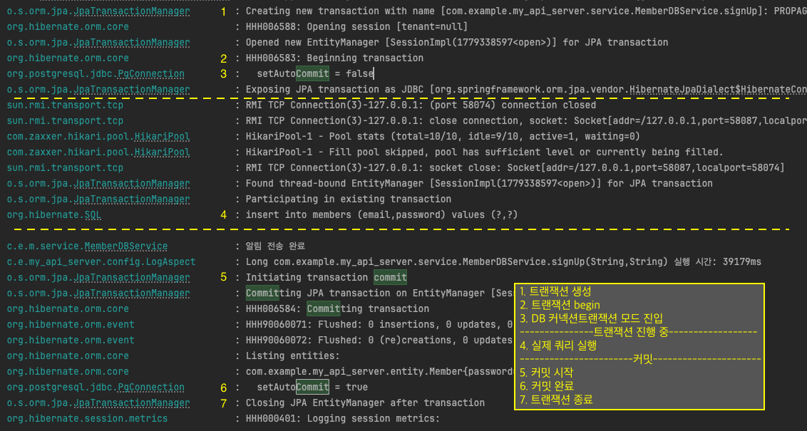
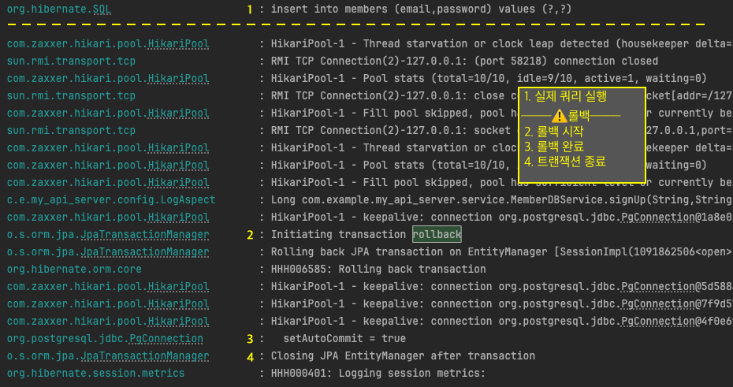
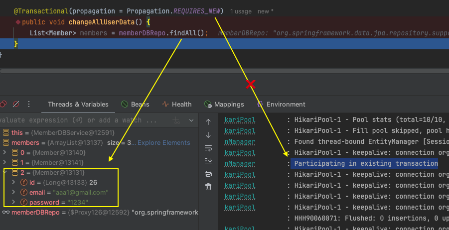
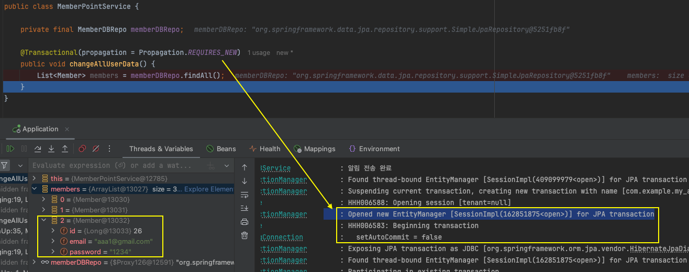

## 트랜잭션 실습

### a) 로그를 활용한 트랜잭션 동작 확인

- commit 동작 로그(정상 작동 혹은 CheckedException 발생)



- rollback 동작 로그(RuntimeException 발생)



### b) IOException 발생 시에도 Rollback이 됐던 이유

**원인: LogAspect가 IOException을 RuntimeException으로 변환**

Spring AOP 실행 순서 (우선순위 기본값 기준):

  ```plaintext
  @Transactional AOP (외부)
    └─ LogAspect AOP (내부)
          └─ MemberDBService.signUp()
  ```

`IOException`을 `LogAspect`가 먼저 잡아 `RuntimeException`으로 래핑한 뒤 바깥의 `@Transactional`에 전달하기 때문에 롤백이 트리거된다.

`LogAspect`를 아래와 같이 수정하면 `IOException` 발생 시 롤백되지 않는다.

**기존**

```plaintext
public Object logging(ProceedingJoinPoint joinPoint) {
    ...
    } catch(Throwable e){
        throw new RuntimeException(e); // IOException → RuntimeException 으로 변환
    } finally{
        ...
}
```

**수정 (catch를 아예 삭제하거나, 예외를 그대로 rethrow)**

```plaintext
public Object logging(ProceedingJoinPoint joinPoint) throws Throwable {
    ...
    } catch(Throwable e){
        throw e;
    } finally{
        ...
}
```

### b) DB에 반영된 척 findAll()을 반환했던 이유

**원인: JPA 1차 캐시 (Persistence Context)**



같은 클래스 내 `@Transactional` 메서드 호출은 **Self-invocation** 문제로 AOP 프록시를 거치지 않아 트랜잭션이 적용되지 않는다.

같은 트랜잭션 내에서는 영속성 컨텍스트(1차 캐시)가 공유된다.

따라서, `save()` 시점에 엔티티가 1차 캐시에 올라간 상태에서 `findAll()`을 호출하면, JPA는 DB 조회 결과에 캐시 객체를 merge하여 반환한 것이다.

```
o.s.orm.jpa.JpaTransactionManager        : Participating in existing transaction
```

별도 클래스로 분리하여 AOP 프록시를 통해 호출해야 실제 DB 데이터만 반환되고, 트랜잭션도 의도대로 동작한다.


