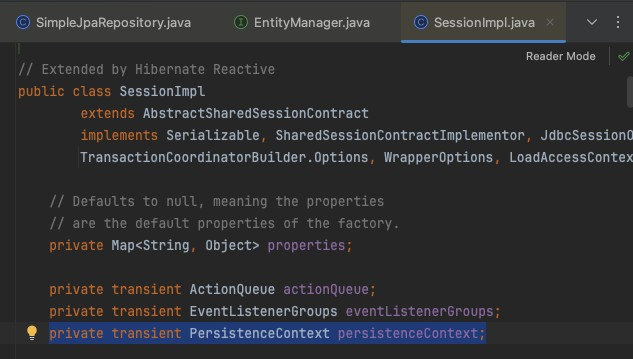
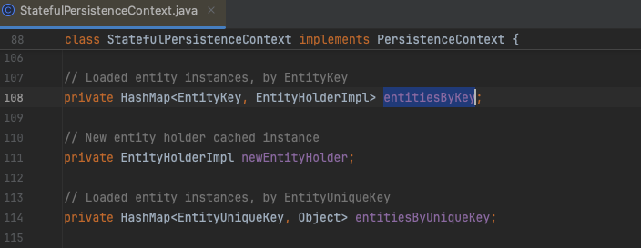
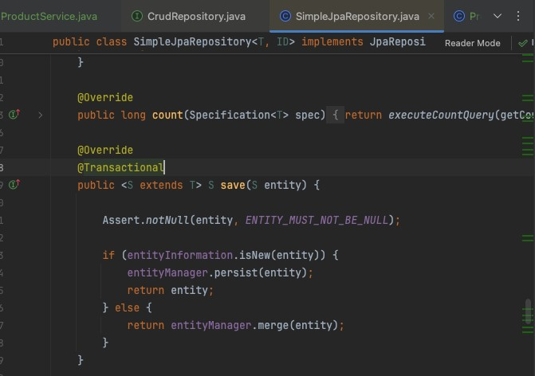

# 0320(금) - Spring API 실습 / JPA

---

## 1. JPA (Java Persistence API)

> Java 객체와 DB 테이블을 매핑해주는 스펙. 실제 구현체는 Hibernate가 담당한다.

JPA는 DB 통신을 효율적으로 하기 위해 `EntityManager`로 **영속성 컨텍스트**를 만든다. 이는 트랜잭션 단위로 관리된다.

- 트랜잭션 시작 → `EntityManager` 생성 → 영속성 컨텍스트 생성 및 데이터 관리
- 트랜잭션 종료(commit/rollback) → 영속성 컨텍스트 비움 → GC 대상

### a) EntityManager와 영속성 컨텍스트 (1차 캐시)

`EntityManager`의 구현체로 `SessionImpl`이 있다.





1. `@Transactional`이 감지되면 JPA가 `EntityManager`를 생성한다.
2. 영속성 컨텍스트를 **HashMap**으로 관리한다. 객체이므로 Heap 영역에 올라간다.
3. 트랜잭션 내부에서 DB와 통신하거나, 영속성 컨텍스트에서 데이터를 조회한다.
4. 트랜잭션 종료 시 영속성 컨텍스트를 비우고 GC 대상이 된다.

영속성 컨텍스트에는 엔티티 객체가 등록된다.

```java
orderRepo.save(order);

// 영속성 컨텍스트 Map 상태
{
EntityKey(Order, 1L)        // → order 객체
EntityKey(OrderProduct, 1L) // → orderProduct1 객체
EntityKey(OrderProduct, 2L) // → orderProduct2 객체
}
```

> 참고: [Red Hat - Java Persistence API](https://docs.redhat.com/en/documentation/red_hat_jboss_enterprise_application_platform/7.3/html/development_guide/java_persistence_api#persistence-context)

---

### b) Entity

Spring 앱 시작 시 Hibernate는 `@Entity` 클래스를 순회하며 메타 정보를 파싱 후 `EntityPersister`에 보관한다. 이로써 메모리 절약과 성능 향상을 이룬다.

**Entity 생성 예시:**

```java

@Entity
@NoArgsConstructor(access = lombok.AccessLevel.PROTECTED)
@AllArgsConstructor
@Table(name = "order_products")
@Getter
@Builder
public class OrderProduct {
    ...
}
```

- `@Entity`: JPA 관리 대상으로 인식
- `@Table`: 테이블 관련 옵션 지정. 생략 시 클래스명 소문자로 테이블 자동 생성

**주요 어노테이션:**

| 어노테이션                                 | 설명                                        |
|---------------------------------------|-------------------------------------------|
| `@Column`                             | 생략 가능. 옵션값 설정 시 사용                        |
| `@ManyToOne(fetch = FetchType.LAZY)`  | 다대일 관계. FK 조회가 발생할 때만 외부 테이블 JOIN         |
| `@ManyToOne(fetch = FetchType.EAGER)` | 쿼리 발생 시 항상 FK 외부 테이블 JOIN → 불필요한 연산 발생 가능 |

> 참고: [e4g3r.tistory.com - EntityPersister](https://e4g3r.tistory.com/52)

---

### c) 양방향 매핑

두 엔티티가 서로를 참조하려면 양방향 매핑이 필요하다.

```java
public class Order {
    @OneToMany(mappedBy = "order", cascade = CascadeType.ALL, orphanRemoval = true) // 양방향 매핑
    List<OrderProduct> orderProducts = new ArrayList<>();
}

public class OrderProduct {
    @ManyToOne(fetch = FetchType.LAZY)
    private Order order;
}
```

단방향 매핑 시 한쪽 참조는 불가능하다.

```java
orderProduct.getOrder()  // ✅ OrderProduct → Order 가능
order.getOrderProducts() // ❌ Order → OrderProduct 불가능
```

---

### d) mappedBy

테이블 간 관계를 정의할 때 사용하는 옵션이다.

- **FK 주인**: `@JoinColumn` 사용
- **반대편**: 관계 어노테이션에 `mappedBy` 옵션으로 양방향 매핑

`mappedBy` 누락 시 중간 조인 테이블이 자동 생성되므로 반드시 명시해야 한다.

**1. One-to-One 양방향 매핑:**

  ```java
  @Entity
  public class Employee {
      @OneToOne
      @JoinColumn(name = "address_id") // FK: employee 테이블
      private Address address;
  }
  
  @Entity
  public class Address {
      @OneToOne(mappedBy = "address") // inverse side
      private Employee employee;
  }
  ```

- `mappedBy` 누락 시: `address` 테이블에 `employee_id` FK 컬럼이 생성됨

**2. Many-to-One 양방향 매핑:**

```java
@Entity
public class Department {
    @OneToMany(mappedBy = "department") // inverse side
    private List<Employee> employees = new ArrayList<>();
}

@Entity
public class Employee {
    @ManyToOne
    @JoinColumn(name = "department_id") // FK: employee 테이블
    private Department department;
}
```

- `mappedBy` 누락 시: `department_employees` 중간 테이블 자동 생성

**3. Many-to-Many 양방향 매핑:**

```java
@Entity
public class Student {
    @ManyToMany
    @JoinTable(
            name = "student_course",
            joinColumns = @JoinColumn(name = "student_id"),
            inverseJoinColumns = @JoinColumn(name = "course_id")
    )
    private List<Course> courses = new ArrayList<>();
}

@Entity
public class Course {
    @ManyToMany(mappedBy = "courses") // inverse side
    private List<Student> students = new ArrayList<>();
}
```

- `mappedBy` 누락 시: `student_course`, `course_student` 두 조인 테이블이 모두 생성됨

> 참고: [medium.com - JPA mappedBy 이해](https://medium.com/@m.immaculate/1-one-to-one-mapping-in-jpa-understanding-mappedby-113589fc493b)

---

### e) cascade 생명주기

`cascade` 옵션으로 부모 엔티티의 생명주기를 자식 엔티티와 동기화할 수 있다.

| 옵션        | 설명                         |
|-----------|----------------------------|
| `ALL`     | 아래 모든 옵션 적용                |
| `PERSIST` | 부모 저장 시 자식도 저장             |
| `MERGE`   | 부모 수정 시 자식도 수정             |
| `REMOVE`  | 부모 삭제 시 자식도 삭제             |
| `REFRESH` | 부모 DB 재조회 시 자식도 재조회        |
| `DETACH`  | 부모가 영속성 컨텍스트에서 분리되면 자식도 분리 |

`CascadeType.ALL` 적용 예시:

```java
order.addOrderProducts(orderProducts);
// 1. 메모리에서 리스트 추가

Order savedOrder = orderRepo.save(order);
// 2. order 영속화
// 3. CascadeType.ALL → orderProducts도 영속화
// 4. 트랜잭션 종료 시 flush → INSERT 실행
```

---

### f) orphanRemoval

> `cascade`가 부모의 생명주기를 자식에게 연결하는 것이라면, `orphanRemoval`은 **부모와의 관계가 끊어질 때 자식을 자동으로 DELETE**하는 옵션이다.

---

## 2. 더티 체킹 (Dirty Checking)

> flush 시점에 영속성 컨텍스트를 순회하며 스냅샷과 비교하는 것. 변경된 엔티티를 자동으로 UPDATE해준다.

### a) @Transactional 없이도 DB에 저장되는 이유

`save()` 구현체 내부에 `@Transactional`이 선언되어 있기 때문이다.

아래 `if` 문이 더티 체킹 로직이다. 새로운 엔티티면 `persist`, 기존 엔티티면 `merge(UPDATE)` 한다.



그러나 **트랜잭션 전파** 문제가 발생할 수 있기 때문에, `save()`를 호출하는 상위 메서드에도 `@Transactional` 명시가 필요하다.

---

### b) 트랜잭션 전파

```java
// @Transactional 없는 경우
public void order() {
    Order order = orderRepo.save(order);   // 트랜잭션 1 시작 → 종료
    orderRepo.save(orderProduct);          // 트랜잭션 2 시작 → 종료
}
```

`save()` 하나당 트랜잭션이 독립적으로 생겼다 사라진다. 둘 중 하나가 실패해도 나머지는 이미 DB에 커밋된 상태 → **데이터 정합성이 깨진다.**

하나라도 실패 시 전체 rollback을 보장하려면 상위 메서드에 `@Transactional`을 명시해야 한다.

---

### c) @Transactional(readOnly = true)

SELECT만 수행하는 경우 DB 쓰기(flush)가 불필요하다. `readOnly = true`로 성능을 최적화할 수 있다.

```java
// SimpleJpaRepository 소스코드
@Transactional(readOnly = true)
public Optional<T> findById(ID id) {
    return Optional.ofNullable(entityManager.find(entityClass, id));
}
```

주로 검색, 조회 메서드에 적용한다.

---

## 3. 기타 메모

- `Status`, `Type` 같은 고정 값은 `enum`으로 관리하는 것이 좋다.
  ```java
  @Enumerated(EnumType.STRING)
  private OrderStatus orderStatus;
  ```

- `@Builder`: 인자값이 많을 때 사용. `of()`: 인자가 단순할 때 사용.
- `@Setter`는 모든 필드를 열어두기 때문에 복잡성이 증가한다. 필요한 필드만 변경하는 전용 메서드를 만드는 것이 권장된다.
