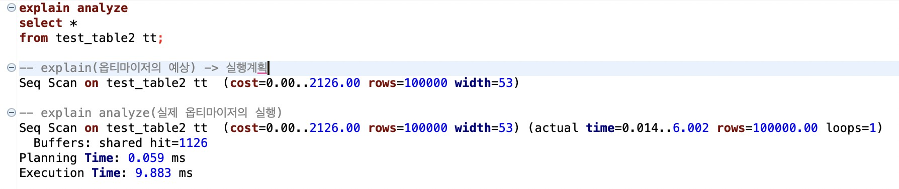

# 0323(월) - DB, DBMS, Index

---

## 1. 데이터베이스와 DBMS

> **데이터베이스**: 데이터를 체계적으로 저장·관리하는 집합. 중복 방지, 빠른 검색, 보안성·무결성 유지를 목적으로 한다.

- **보안성**: 접근 권한을 제어하는 것
- **무결성**: 데이터가 규칙에 맞게 정확한 상태를 유지하는 것 ("무결(無缺)" = 결함이 없다)

**DBMS(Database Management System)**: 데이터베이스를 관리·운영하는 소프트웨어. 4가지 형태가 있다.

| 형태 | 설명 | 현황 |
|---|---|---|
| **계층형** | 수직 Tree 형태. 1:1 관계만 표현 | 현재 사용 X |
| **망형** | 노드 간 관계를 나타낸 그래프 구조. 복잡해 유지보수 어려움 | 현재 사용 X |
| **관계형** | 테이블 단위로 구성, 그 안에 데이터 저장 | **현재 대부분 사용** |
| **객체지향형** | 데이터를 객체로 관리. 관계형 DB와 객체 간 불일치(impedance mismatch)가 존재하며, JPA 같은 ORM이 이를 해소해준다. | 일부 사용 |

> **객체지향형 DBMS ≠ JPA**: JPA는 객체지향형 DBMS 변환 도구가 아니다. JPA는 **관계형 DB**를 대상으로, Java 객체와 테이블을 매핑해주는 ORM 프레임워크다. 즉, 객체지향형 DBMS가 따로 있는 게 아니라, 관계형 DB를 객체처럼 다룰 수 있게 해주는 것이 JPA다.

---

## 2. RDBMS 특징

### a) 테이블 기반 구조
하나 이상의 열(속성)과 행(레코드)으로 구성된다.

### b) 키(Key)
- `PK` (기본키): NULL 및 중복 불가
- `FK` (외래키): 다른 테이블의 PK를 참조. **참조 무결성** 보장

### c) 테이블 간 관계
1:1, 1:N, N:M 관계를 PK와 FK로 표현한다.

### d) SQL 지원
DML 기능 제공. 조건·필터링·집계·정렬·그룹화 등 유연한 데이터 검색을 지원한다.

### e) ACID 속성 (트랜잭션 무결성 보장)

| 속성 | 설명 |
|---|---|
| **Atomicity** (원자성) | 트랜잭션은 전부 성공하거나 전부 실패 |
| **Consistency** (일관성) | 트랜잭션 전후로 DB에 설정된 규칙이 항상 지켜져야 함 |
| **Isolation** (격리성) | 트랜잭션은 서로 간섭하지 않음 |
| **Durability** (지속성) | 커밋된 데이터는 영구 보존 |

### f) 제약 조건
데이터 무결성 유지를 위한 제약 조건 지원: `NOT NULL`, `UNIQUE`, `CHECK`, `FOREIGN KEY`

### g) 정규화 (Normalization)
중복 최소화, 종속성 축소를 위해 데이터를 여러 테이블로 분리하는 과정.
삽입·수정·삭제 시 발생할 수 있는 이상 현상(Anomaly)을 방지한다.

> **함수 종속**: 행 A가 행 B를 결정할 때, B는 A에 **함수 종속**된다.
> e.g.) 학번(A) → 학생이름(B)

| 정규형 | 위반 조건 |
|---|---|
| **1NF** | 셀에 원자값이 아닌 여러 값이 존재 |
| **2NF** | 복합 PK `(A, B) → C`인데 `B → C`만으로 결정되는 부분 함수 종속 존재 |
| **3NF** | `A → B → C` 형태의 이행 함수 종속 존재 (이행, 移行 = "거쳐간다") |
| **BCNF** | 결정자가 후보키가 아닌 경우 존재 (테이블 내 모든 결정자는 후보키여야 함) |

### h) 트랜잭션 관리
데이터 조작 중 발생할 수 있는 문제를 최소화하여, 데이터 일관성을 유지하면서 동시접근을 가능하게 한다.

---

**헷갈리는 용어 정리**

| 용어 | 설명 |
|---|---|
| **무결성** (값 자체) | 데이터에 결함이 없는 상태 |
| **일관성** (규칙) | 트랜잭션 전후로 DB 규칙이 깨지지 않음 |
| **정합성** (테이블 간 관계) | 여러 테이블의 데이터가 서로 맞아떨어짐 (FK가 가리키는 행이 실제로 존재) |
| **참조 무결성** | FK가 참조하는 값이 실제로 존재 |
| **트랜잭션 무결성** | 트랜잭션이 ACID를 지킴 |

---

## 3. 인덱스

> 데이터를 빠르게 찾기 위한 자료구조. DB 성능 최적화의 핵심 요소.

DB는 디스크에서 값을 읽어오는데 이를 **Disk I/O**라고 하며, 속도가 매우 느리다.
성능 튜닝의 핵심은 **인덱스를 이해하고 Disk I/O를 최소화하는 방향으로 설계**하는 것이다.

- 인덱스는 키 값과 `TID`(Tuple Identifier, 튜플의 물리적 위치)를 연결한다.
- `TID`로 Disk에서 데이터를 가져와 버퍼 캐시에 적재한다.
- 인덱스 설계 시 **카디널리티**를 고려해야 한다.
  - 카디널리티(선택도)가 높다 = 반환되는 범위가 좁다 = 성능에 유리
  - 복합 인덱스는 컬럼 **순서**도 중요하다.

### a) 인덱스 구조와 유형 (PostgreSQL 기준)

| 유형 | 특징 |
|---|---|
| **B-Tree** | 기본 인덱스. `O(log N)`. Root → Branch → Leaf(TID 저장) 순으로 탐색. 균형 트리라 모든 리프 노드가 동일 깊이를 가짐. `ORDER BY`, `JOIN`에 유리. 기본키·유니크 제약에 사용 |
| **Hash** | 동등 비교(`=`) 연산만 지원. 읽기는 빠르지만 쓰기·정렬에 불리. 버킷 페이지 직접 접근으로 대규모 테이블에서 I/O 감소 |
| **BRIN** | 최솟값·최댓값만 저장. 시계열·대용량 데이터에 적합 |
| **GIN** | 복합 데이터 검색에 적합. 텍스트·배열·JSONB 등에서 특정 요소 검색 지원 |
| **GiST / SP-GiST** | 지리정보(x, y 벡터값) 저장에 적합 |

### b) 인덱스 종류 (MySQL vs PostgreSQL)

**MySQL InnoDB:**

1. **클러스터링 인덱스**: 테이블 생성 시 PK 기준으로 자동 생성. 리프 노드가 곧 데이터 페이지. B-Tree 구조라 삽입/삭제마다 정렬 연산 발생.
    ```
    루트 페이지 (B-Tree 루트노드)
            │
       중간 페이지
            │
    ┌───────────────────────────────┐
    │         리프 페이지            │  ← 데이터 페이지 자체
    │  id=1 │ name=철수 │ age=25    │
    │  id=2 │ name=영희 │ age=20    │
    │  id=3 │ name=민수 │ age=30    │
    └───────────────────────────────┘
    ```

2. **논클러스터링 인덱스**: PK 외 컬럼으로 만든 인덱스. 데이터 전체가 아닌 인덱스 값과 PK만 저장. PK로 클러스터링 인덱스를 한 번 더 탐색해 실제 데이터를 가져온다.
    ```
    논클러스터링 인덱스 (age 기준) 리프노드
    ┌─────────────┐
    │ age │  PK   │
    │  20 │ id=2  │  ← PK로 클러스터링 인덱스 탐색
    │  25 │ id=1  │
    │  30 │ id=3  │
    └─────────────┘
           ↓
    클러스터링 인덱스에서 id로 실제 데이터 찾음
    ```

**PostgreSQL:** → [섹션 6-d 참조](#d-postgresql의-인덱스-구조)

### c) 인덱스 설계 원칙

단일 또는 복합 인덱스로 설계한다.

- **단일 인덱스**: `WHERE` 절에 단독으로 자주 쓰이는 컬럼으로 구성
- **복합 인덱스**: 쿼리 패턴, B-Tree 구조, 옵티마이저, 카디널리티, 통계정보(데이터 분포 등)를 고려해 구성

**복합 인덱스 설계 원칙:**

1. **왼쪽부터 순서대로 사용** — 순서를 건너뛰면 Full Scan 발생
2. **카디널리티가 높은 컬럼을 선행으로** — 조회 범위가 좁아져 빠른 응답 (e.g. 주민등록번호)
3. `WHERE` 절에서 자주 쓰이는 컬럼을 인덱스로 구성
4. 범위 검색 컬럼은 순서를 뒤로 배치
5. `ORDER BY`, `GROUP BY`에 자주 쓰이는 컬럼을 인덱스로 구성 → Sort 연산 비용 절감 (Sort 비용은 매우 크다)
6. 커버링 인덱스(`SELECT [index]`): 연산 비용이 줄지만 권장되지는 않음

> 핵심: **탐색 범위를 줄이는 것**이 인덱스 설계의 본질이다.

### d) 인덱스 단점

- **UUID를 PK로 사용하면 안 된다**: B-Tree는 삽입 시 정렬 연산이 발생한다. UUID는 랜덤값이라 매 삽입마다 정렬 비용이 크다. 1씩 증가하는 순차 ID(AUTO_INCREMENT)가 유리하다.
- 인덱스 페이지는 shared buffer에 캐시되므로, 인덱스가 많을수록 메모리 부담이 증가한다.

---

## 4. Optimizer

> 수학적 모델에 따라 최적의 실행 계획을 선택하는 계산기. RDB 성능의 핵심.

PostgreSQL은 기본적으로 **CBO(Cost Based Optimizer, 비용 기반 옵티마이저)** 를 사용한다.
여러 실행 계획 후보를 계산해, **cost가 가장 낮은 계획을 선택**한다.

### a) Cost 계산 방식

Cost는 **예측값**이다. 통계정보를 기반으로 아래 가중치를 곱해 합산한다.

```
전체 cost = (읽을 페이지 수 × seq_page_cost)
          + (읽을 행 수   × cpu_tuple_cost)
          + (인덱스 탐색  × cpu_index_tuple_cost)
          + ...
```

| 파라미터 | 기본값 | 의미 |
|---|---|---|
| `seq_page_cost` | 1.0 | **기준값**. 모든 cost는 이 단위 기준 |
| `random_page_cost` | 4.0 | 랜덤 I/O는 순차보다 4배 비싸다고 가정 |
| `cpu_tuple_cost` | 0.01 | 행 하나를 처리하는 CPU 비용 |
| `cpu_index_tuple_cost` | 0.005 | 인덱스 항목 하나를 처리하는 CPU 비용 |

따라서 `cost=2126.00`은 ms가 아니라, 이 가중치 단위 체계 안에서의 **상대적 비용**이다.

아래 쿼리로 현재 시스템에 설정된 가중치를 확인할 수 있다.

```sql
SELECT name, setting
FROM pg_settings
WHERE name IN (
    'seq_page_cost', 'random_page_cost',
    'cpu_tuple_cost', 'cpu_index_tuple_cost', 'cpu_operator_cost'
);
```

### b) Cost가 예측값인 이유

Optimizer는 실제 실행 전에 통계정보(테이블 크기, 데이터 분포 등)를 기반으로 cost를 **추정**한다.
통계정보가 오래됐거나 부정확하면 예측치(`cost`)와 실측치(`actual time`)의 차이가 커진다.

→ 차이가 크다면 `ANALYZE` 명령으로 통계정보를 갱신해야 한다.

---

## 5. 실행계획 (Execution Plan)

SQL 수행 시 수집된 통계정보(테이블 정보, 데이터 분포 등)를 참조해 수립된다.

> **Oracle vs PostgreSQL**: Oracle은 파싱된 실행계획을 공유 메모리에 보관해 재사용한다. PostgreSQL은 이를 지원하지 않아 주기적으로 실행계획 최적화 및 재파싱이 필요하다.

**SQL 처리 흐름:**
```
  SQL
   ↓
Parser   : 문법 검사, 객체 확인
   ↓
Analyzer : 타입 결정, 권한 체크
   ↓
Rewriter : View 확장, Rule 적용
   ↓
Planner  : 비용 계산 (Cost-Based Optimizer)
   ↓
Plan Tree: 실행계획 트리 생성
   ↓
Executor : 실제 실행
```



**`EXPLAIN ANALYZE` 출력 읽는 법:**

```sql
-- 예측치 (Planner가 실행 전 계산)
(cost=0.00..2126.00 rows=100000 width=53)
--  └ 옵티마이저가 계산한 상대적 비용 단위 (ms가 아님, seq_page_cost=1.0 기준의 임의 단위)

-- 실측치 (Executor가 실제 실행 후 측정, EXPLAIN ANALYZE 시에만 출력)
(actual time=0.014..6.002 rows=100000 loops=1)
--            └ 실제 수행 시간 (ms 단위)
```

- `Seq Scan`: 인덱스 미사용, 테이블 풀스캔 → 느림
  - 해결: 인덱스 추가 또는 페이징 쿼리 적용
- 예측치와 실측치 차이가 크다면 → **통계정보**가 최신 상태인지 확인한다.

---

## 6. 실행계획 예시 (PostgreSQL)

### a) 인덱스 없을 때 — Full Scan

실측치: 8.47ms, 100,000건 전부 읽고 버림, 버퍼 1,126개 접근 → 비효율

```sql
Seq Scan on test_table2 tt  (cost=0.00..2376.00 rows=1 width=53)
                             (actual time=8.452..8.453 rows=0 loops=1)
  Filter: (email = 'user1@gmail.com')
  Rows Removed by Filter: 100000
  Buffers: shared hit=1126
Execution Time: 8.471 ms
```

### b) 인덱스 있을 때 — Index Scan

실측치: 0.23ms, 1건 탐색, 버퍼 3개 접근 → 효율적

```sql
Index Scan using idx_test_users_email on test_table2 tt  (cost=0.42..8.44 rows=1 width=53)
                                                          (actual time=0.145..0.146 rows=0 loops=1)
  Index Cond: (email = 'user1@gmail.com')
  Index Searches: 1
  Buffers: shared read=3
Execution Time: 0.232 ms
```

### c) 복합 인덱스

컬럼 순서에 따라 Index Searches 횟수와 Disk I/O가 확연히 달라진다.

```sql
Bitmap Heap Scan on test_table2 tt  (cost=274.20..1695.67 rows=19698 width=53)
                                     (actual time=1.589..6.534 rows=19635 loops=1)
  Recheck Cond: (city = 'SEOUL' AND age > 30)
  Heap Blocks: exact=1126
  Buffers: shared hit=1126 read=19
  ->  Bitmap Index Scan on idx_test_table2_city_age
        Index Cond: (city = 'SEOUL' AND age > 30)
        Index Searches: 1
        Buffers: shared read=19
Execution Time: 7.515 ms
```

### d) ORDER BY — Sort 연산

인덱스 없이 `ORDER BY` 사용 시 Sort 연산이 발생하고 비용이 매우 크다. 인덱스가 있으면 Index Scan으로 Sort 연산 없이 처리된다.

```sql
-- username 컬럼에 인덱스 없음 → Sort 발생
Sort  (cost=13850.32..14100.32 rows=100000 width=53)
      (actual time=118.254..130.105 rows=100000 loops=1)
  Sort Key: username
  Sort Method: external merge  Disk: 7176kB   ← 디스크까지 사용
  Buffers: shared hit=1126, temp read=897 written=899
  ->  Seq Scan on test_table2 tt
        Buffers: shared hit=1126
Execution Time: 132.116 ms   ← Index Scan 대비 약 570배 차이
```

---

## 7. 기타 메모

### a) 인덱스 변경 비용

테이블 데이터가 많을수록 인덱스도 함께 커진다. 인덱스 변경 시 모든 데이터를 재구성해야 하므로 **작업 시간이 매우 길어진다.** 초기 설계가 중요한 이유다.

### b) Java에서 복합 PK를 쓰지 않는 이유

복합 PK 사용 시 아래 번거로움이 따른다.

```java
// 복합 PK용 별도 클래스 필수
@Embeddable
public class OrderProductId implements Serializable {
    private Long orderId;
    private Long productId;

    // equals(), hashCode() 직접 구현 필수
}

// 엔티티에서
@EmbeddedId
private OrderProductId id;

// 조회 시에도 객체를 직접 생성해서 넘겨야 함
repo.findById(new OrderProductId(orderId, productId));
```

대신 **대리키(surrogate key)** 를 PK로 두고, 복합 유니크 조건을 별도로 거는 패턴을 주로 사용한다.

```java
@Id
@GeneratedValue(strategy = GenerationType.IDENTITY)
private Long id;  // 단순 대리키

// 복합 유니크 조건은 별도 설정
@Table(
    uniqueConstraints = @UniqueConstraint(
        columnNames = {"order_id", "product_id"}
    )
)
```

### c) MySQL vs PostgreSQL 인덱스 지원 비교

| 인덱스 | MySQL | PostgreSQL |
|---|---|---|
| **B-Tree** | ✅ (기본) | ✅ (기본) |
| **Hash** | MEMORY 테이블 한정 | ✅ 모든 테이블, 트랜잭션 안전 |
| **GIN** | ❌ | ✅ JSON, 전문검색 |
| **GiST** | ❌ | ✅ 지리, 범위 데이터 |
| **BRIN** | ❌ | ✅ 시계열 대용량 |
| **Partial Index** | ❌ | ✅ |
| **Expression Index** | ❌ | ✅ |

**PostgreSQL이 유리한 경우:**
- GIN, GiST, BRIN 등 특수 인덱스가 필요한 경우
- 지리 정보, JSON, 시계열 등 복잡한 쿼리 패턴

**MySQL이 유리한 경우:**
- Full-text search가 핵심인 서비스
- 단순하고 가벼운 구성이 필요한 경우

> **공통 결론**: 인덱스는 조회를 빠르게 하지만, INSERT/UPDATE 시 인덱스도 함께 갱신해야 하므로 **쓰기 비용이 발생**한다. 무조건 많이 만드는 게 아니라 **쿼리 패턴에 맞게 전략적으로** 설계해야 한다.

> 참고: [Bytebase - Postgres vs MySQL Indexing](https://www.bytebase.com/blog/postgres-vs-mysql-indexing-options/)

### d) PostgreSQL의 인덱스 구조

MySQL과 달리 **클러스터링 인덱스가 존재하지 않는다.** 모든 데이터는 삽입 순서로 **Heap 파일**에 저장되며, PK 설정 시 `ctid` 기반의 별도 B-Tree 인덱스가 자동 생성된다.

```
PostgreSQL PK 설정 시

heap (데이터, 삽입 순서)        PK 인덱스 (별도 B-Tree)
┌────────────────────┐         ┌──────────────────┐
│ id=3 │ name=민수   │         │ id=1 → ctid(1,2) │
│ id=1 │ name=철수   │         │ id=2 → ctid(1,3) │
│ id=2 │ name=영희   │         │ id=3 → ctid(1,1) │
└────────────────────┘         └──────────────────┘
  정렬 없이 삽입 순서              ctid: (페이지 번호, 행 위치)
```

> 참고: [PostgreSQL 공식 문서 - Primary Keys](https://www.postgresql.org/docs/current/ddl-constraints.html#DDL-CONSTRAINTS-PRIMARY-KEYS)

**MySQL vs PostgreSQL 쓰기/읽기 성능:**

- **MySQL**: 클러스터링 인덱스 덕분에 단일 PK 조회, 대용량 순차 조회에 유리. 단, 삽입/삭제마다 정렬 비용 발생
- **PostgreSQL**: 클러스터링 인덱스가 없어 PK 조회 시 인덱스 → heap으로 2번 참조가 발생하지만, 삽입/삭제 시 정렬 비용이 없어 **쓰기 성능에 유리**
