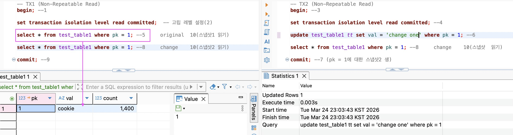
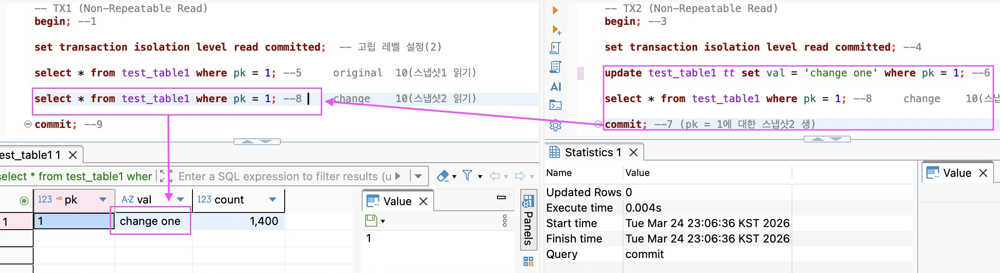
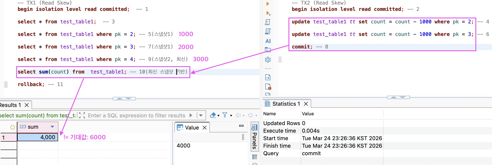
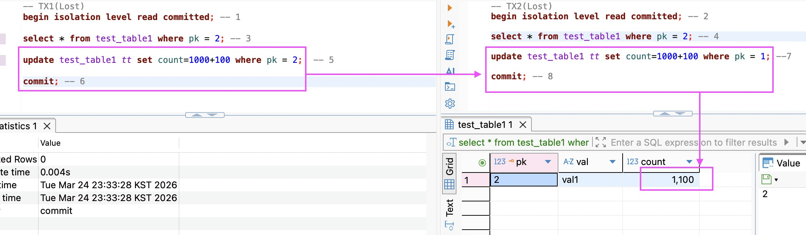
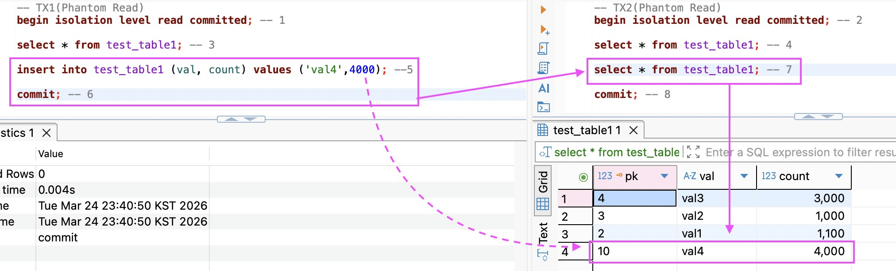
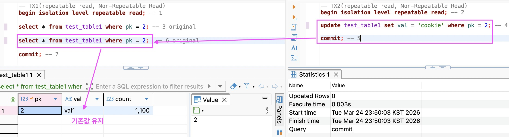
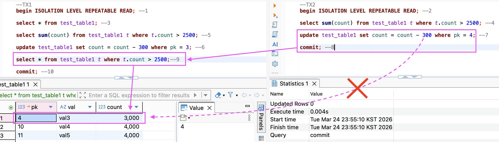

# 0324(화) - DB Architecture, 격리 수준, MVCC

---

## 1. PostgreSQL 아키텍처

### a) 프로세스 구조

| | MySQL | PostgreSQL |
|---|---|---|
| 클라이언트 연결 단위 | 스레드 (1:1) | 프로세스 (1:1) |

- **Postmaster**: 연결 요청 수신(TCP/IP), 자식 프로세스 관리
- **Backend Process**: 쿼리 분석 및 실행
- **Background Process**: 보조 프로세스 (WAL Writer, Vacuum 등)

### b) 메모리 구조

| 영역 | 설명 |
|---|---|
| **Shared Buffer** | 디스크에서 읽어온 데이터 페이지를 캐싱하는 공유 메모리. 모든 프로세스가 공유 → 동시성 문제 발생 |
| **WAL Buffer** | 데이터 변경 이력(WAL)을 디스크에 기록하기 전 임시 저장 |
| **Local Memory** | 각 Backend 프로세스가 정렬·조인 작업 시 사용하는 전용 메모리 |

### c) 저장소 구조

| 영역 | 설명 |
|---|---|
| **Data Files** | 실제 테이블·인덱스 데이터. 8KB 단위의 '페이지' 형태로 저장 |
| **WAL** | 변경 사항을 기록하는 로그 파일 (WAL Buffer에 먼저 저장 후 디스크에 기록) |

### d) 쿼리 처리 흐름

```
Parser    : 쿼리 문법 체크
    ↓
Optimizer : 인덱스 사용 여부 등 최적 실행 경로 계산
    ↓
Executor  : 계획에 따라 데이터 읽고 결과 반환
```

---

## 2. PostgreSQL 트랜잭션 동시성 관리

> **동시성**: 여러 트랜잭션이 동시에 실행될 수 있는 능력
> **일관성**: 동시에 실행되더라도 데이터가 올바른 상태를 유지하는 것

**Read/Write에서 동시성 문제가 발생하는 이유:**
- 프로그램이 OS 커널로부터 메모리와 스레드를 할당받기 때문
- Shared Buffer 캐싱을 여러 프로세스가 공유하기 때문

PostgreSQL은 **MVCC**와 **Lock**으로 트랜잭션 동시성을 관리한다.

| 작업 | 방식 | 특징 |
|---|---|---|
| **Read** | MVCC | 다중 버전으로 일관성 보장. Lock-free |
| **Write** | Lock | 동시 쓰기 충돌 방지. 배타적 락, 대기 발생 |

### a) MVCC (Multi Version Concurrency Control)

> 다중 버전 동시성 제어. 동일 데이터에 대한 변경 전·후의 여러 버전을 동시에 저장해 상호 간섭 없이 일관성을 보호한다.

MVCC는 **스냅샷**을 활용한다.

### b) 격리 수준 (Isolation Level)

ACID 원칙의 일부를 희생하면서 트랜잭션의 동시성을 보장하기 위해 사용한다.

```
Read Uncommitted ── Read Committed ── Repeatable Read ── Serializable

  ← 성능 높음                                    격리 수준 높음 →
```

| 항목 | 내용 |
|---|---|
| **기본 격리 수준** | Read Committed |
| **제공 수준** | Read Committed, Repeatable Read, Serializable |
| **Read Uncommitted 미제공 이유** | MVCC가 Dirty Read를 방지하기 때문. 다른 DB에서는 Read Uncommitted에서 Dirty Read가 발생한다. |

### c) XID (Transaction ID)

MVCC에 따라 동일 튜플에 대해 여러 버전이 존재하고, 이를 **XID**로 구분한다.

**페이지 구조:**
```
트랜잭션 → XID → itemid(포인터) → item(tuple, 실제 데이터)
```

- 페이지 단위로 데이터를 저장하며, item이라는 튜플에 데이터가 담긴다.
- 데이터 변경 시점(INSERT, UPDATE, DELETE)에 XID가 할당된다.

### d) 스냅샷

하나의 튜플에 대해 버전별로 여러 튜플을 관리하는 것. 트랜잭션 시작 시 자동 생성된다.

**격리 수준별 스냅샷 생성 시점:**

| 격리 수준 | 스냅샷 생성 시점 |
|---|---|
| **Read Committed** | 매 쿼리마다 새로 생성 |
| **Repeatable Read** | 트랜잭션의 첫 쿼리 시 생성 후 유지 |
| **Serializable** | 첫 쿼리 시 생성 + 트랜잭션 간 의존성 그래프 추적 |

**튜플의 가시성**: 스냅샷에서 보이는 범위. 트랜잭션 시작 시점과 커밋 여부에 의해 결정된다.

---

## 3. 데이터 이상 현상 (Anomaly)

PostgreSQL은 모든 격리 수준이 MVCC 기반이지만, 격리 수준별로 동시성 제어가 달라져 데이터 일관성 문제가 발생할 수 있다.

| 격리 수준 | 발생 가능한 이상 현상 |
|---|---|
| **Read Committed** | Non-Repeatable Read, Phantom Read, Read Skew, Lost Update |
| **Repeatable Read** | Write Skew, 비정상 Read-only transaction |
| **Serializable** | 이상 현상 가능성 발견 즉시 트랜잭션 차단 |

### a) Read Committed의 이상 현상

> PG의 기본 격리 수준. Dirty Read 불허. 커밋된 데이터만 조회 가능.
> 매 쿼리마다 새로운 스냅샷을 생성하기 때문에 아래 이상 현상이 발생한다.

**1. Non-Repeatable Read**: 같은 트랜잭션 안에서 같은 행을 재조회할 때 값이 달라지는 현상

TX1에서 `val=cookie`임을 확인했다.



TX2에서 해당 레코드를 수정 후 커밋하면, TX1에서 수정된 `val='change one'`이 보인다.



TX2가 커밋하기 전이라면 TX1에는 기존 스냅샷이 적용되어 `val='cookie'`가 그대로 보인다. (Dirty Read 방지)

> ⚠️ **개발 시 문제점**: `findById` 등으로 같은 행을 2번 조회할 때 값이 달라질 수 있다. 데이터 무결성과 신뢰성이 깨질 수 있다.

---

**2. Read Skew**: 같은 트랜잭션 안에서 여러 행 사이의 논리적 일관성이 깨지는 현상



TX1이 끝나기 전에 TX2의 커밋 영향을 받아 기대값과 달라지는 현상이 발생한다.

---

**3. Lost Update**: 동시에 진행 중인 두 트랜잭션에서 한 트랜잭션의 변경 사항이 다른 트랜잭션에 의해 덮어씌워지는 현상



`count`에 100씩 더하는 TX1, TX2가 동시에 실행되면, 기대값 1200이 아닌 1100이 된다.

- **해결법**: `SET count = count + 100`처럼 현재 값을 기준으로 하는 쿼리를 사용한다.

> ⚠️ **개발 시 문제점**: JPA 더티체킹은 자동으로 처리되지만, JPQL을 직접 작성할 경우 수동으로 처리해야 한다.

---

**4. Phantom Read**: 트랜잭션 내에서 없었던 새로운 레코드가 나타나는 현상



TX2가 INSERT 후 커밋하면, TX1의 재조회 시 해당 레코드가 보인다.

> ⚠️ **개발 시 문제점**: `firstCount ≠ secondCount`가 돼 특정 로직이 동작하지 않을 수 있다. 격리 수준을 올리거나 내부 로직을 수정해 해결해야 한다.

---

### b) Repeatable Read

> 트랜잭션 시작 후 첫 쿼리에서 스냅샷을 찍고 트랜잭션 종료 시까지 유지한다.
> 이로 인해 Non-Repeatable Read 및 Lost Update가 방지된다.

**PostgreSQL의 Repeatable Read 장점**: MVCC가 레코드별로 스냅샷을 관리하기 때문에, MySQL과 달리 **Phantom Read도 발생하지 않는다.**

**Non-Repeatable Read 방지:**



**Lost Update 방지:** 동시 업데이트 감지 시 아래 에러를 반환한다.
```
SQL Error [40001]: ERROR: could not serialize access due to concurrent update
```

그러나 아래 이상 현상은 발생한다.

**Write Skew**: 두 트랜잭션이 각각 다른 행을 수정했지만, 그 조합이 논리적으로 일관성을 위반하는 현상



---

## 4. 기타 메모

**이전 버전 튜플(Dead Tuple) 처리:**
MVCC는 스냅샷 관리를 위해 이전 버전 튜플을 메모리에 계속 보관한다. 이를 **Dead Tuple**이라 하며, `Vacuum`이 주기적으로 청소한다. 내부 메모리를 많이 사용하기 때문에 Vacuum 튜닝이 중요하다.
