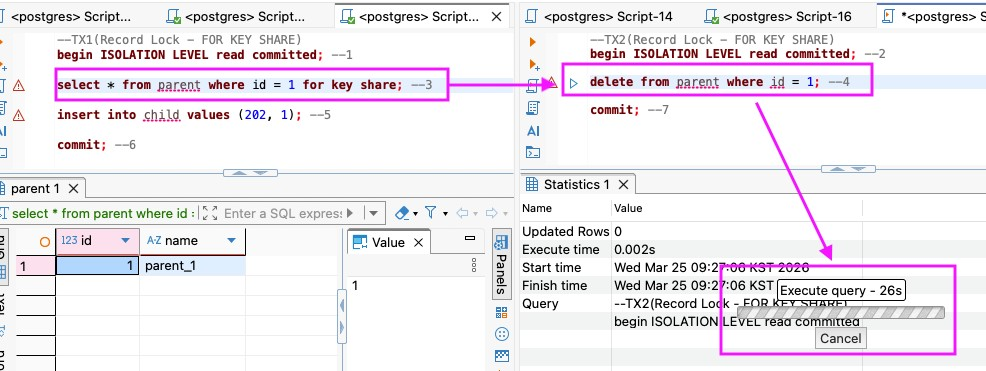
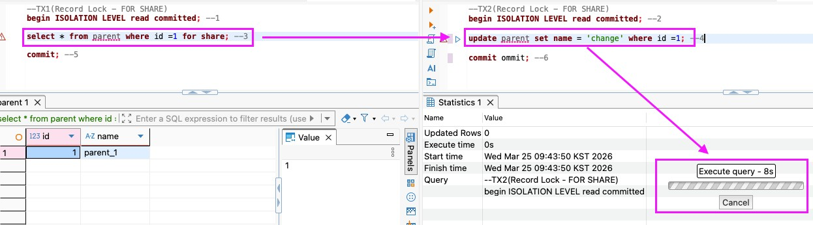

# 0325(수) - 동시성 관리, 대규모 DB 설계

---

## 1. PostgreSQL 동시성

> 동시성의 핵심: 동시에 읽고 쓰는 것을 가능하게 하는 것.
> "R → W 막지 않음, W → R 막지 않음"

PostgreSQL은 **MVCC**와 **Lock**으로 동시성을 관리한다.

### a) Lock 종류

- **Table Lock**: 테이블 단위 락. DB가 대부분 자동으로 관리하며 개발자가 제어할 부분은 적다.
- **Record Lock**: 특정 행(Row)에만 락을 건다. 실제 비즈니스 로직(결제, 재고 차감 등)에서 핵심적으로 사용된다. ⭐️
- **Advisory Lock**: 개발자가 직접 정의하는 커스텀 락

> **락 호환성**: 동일한 행에 두 락이 동시에 걸릴 수 있는지 나타내는 것.
> `일반 SELECT`는 모든 락과 호환된다. (MVCC 덕분에 Lock-free)
> 락 간 충돌은 쓰기 락에서만 발생한다.

---

### b) Table Lock 종류

번호가 클수록 더 많은 연산과 충돌한다. 즉, 동시성을 더 타이트하게 관리한다.

`ACCESS SHARE` → `ROW SHARE` → `ROW EXCLUSIVE` → `SHARE UPDATE EXCLUSIVE` → `SHARE` → `SHARE ROW EXCLUSIVE` → `EXCLUSIVE` → `ACCESS EXCLUSIVE`

---

### c) Record Lock 종류 ⭐️

| Lock | 설명 | 락 호환성 |
|---|---|---|
| **FOR KEY SHARE** | FK 무결성 보호. PK의 UPDATE/DELETE 시도 세션에 락 | 여러 세션이 동시에 걸 수 있음. 다른 세션의 Read 방해 X |
| **FOR SHARE** | 행의 모든 컬럼 변경 방지. UPDATE/DELETE 시도 세션에 락 | `FOR SHARE`끼리는 충돌 X. 양쪽이 동시에 Write 시도 시 교착상태 → PG가 감지 후 한쪽 강제 종료 |
| **FOR NO KEY UPDATE** | PK·Unique 인덱스 컬럼 제외한 나머지 컬럼 수정 시 사용. 일반 UPDATE 쿼리가 사실 이것 | `FOR KEY SHARE`와 충돌 X. `FOR SHARE`와 충돌 O |
| **FOR UPDATE** | 가장 강한 락. 일반 SELECT·INSERT는 가능하지만 다른 명시적 락 시도는 모두 대기 | - |

**FOR KEY SHARE 예시:**



커밋 후 FK 무결성 위반 에러:
```sql
-- child의 FK가 parent.id=1을 참조 중이라 update/delete 불가
SQL Error [23503]: ERROR: update or delete on table "parent" violates foreign key constraint "child_p_id_fkey" on table "child"
  Detail: Key (id)=(1) is still referenced from table "child".
```

**FOR SHARE 예시:**



Lock을 건 트랜잭션이 커밋되면 변경사항이 반영된다.

---

### d) for share vs for update — 스냅샷 참조 차이

`for share`는 같은 스냅샷을 공유하지만, `for update`는 커밋 이후의 **최신 스냅샷을 강제 참조**한다.

```sql
-- for share끼리: 같은 스냅샷 참조
-- TX1
SELECT * FROM parent WHERE id = 1 FOR SHARE; -- 스냅샷 1

-- TX2
SELECT * FROM parent WHERE id = 1 FOR SHARE; -- 스냅샷 1
```

```sql
-- for update → for share: 스냅샷이 달라짐
-- TX1
SELECT * FROM parent WHERE id = 1 FOR UPDATE; -- 스냅샷 1
COMMIT;

-- TX2
SELECT * FROM parent WHERE id = 1 FOR SHARE; -- 스냅샷 2 (TX1 커밋 이후)
```

---

### e) UPDATE 케이스

PostgreSQL은 UPDATE 시 동일한 행의 접근을 막는다. 다른 행은 동시성을 허용한다.

| 케이스 | 결과 |
|---|---|
| UPDATE(TX1) → SELECT(TX2) | 정상 실행. TX1 커밋 여부에 따라 TX2에 보이는 스냅샷이 다름 |
| UPDATE(TX1) → UPDATE(TX2, **같은 행**) | Lock 발생, TX2 대기 |
| UPDATE(TX1) → UPDATE(TX2, **다른 행**) | 정상 실행 |

→ 다른 행은 동시성을 허용하기 때문에 **batch update, bulk update**가 가능해진다.

> 스냅샷은 쿼리 실행 시점에 커밋된 데이터만 포함된다.
> 같은 트랜잭션 내에서는 트랜잭션 가시성에 따라 커밋 전 변경 이력도 읽힌다.

---

### f) Java에서의 Record Lock

```java
@Lock(LockModeType.PESSIMISTIC_WRITE)
```

DB마다 동작이 다르므로 주의가 필요하다.

---

## 2. 대규모 DB 설계

트래픽 증가 시 아래 문제가 발생한다.

| 문제 | 내용 |
|---|---|
| **성능** | 인덱스 비대화, 쿼리 스캔 비용 증가, 캐시 미스 증가, Disk I/O 증가 |
| **스토리지** | 디스크 용량 부족, IOPS 저하 |
| **동시성** | Write Lock 교착상태, Transaction Contention 빈발 |
| **네트워크** | DB 과부하, SPOF(Single Point of Failure) — 단일 장애 지점으로 시스템 전체 중단 위험 |

→ **분산 아키텍처로 해결한다.**

### a) RDB 확장 전략

| 전략 | 설명 | 장점 | 단점 |
|---|---|---|---|
| **파티셔닝** | 같은 서버 내에서 테이블을 물리적으로 분리 (최후의 보루) | Partition Pruning — 필요한 파티션만 읽어 성능 최적화 | 한 번 설정하면 수정 어려움 |
| **샤딩** | 여러 서버(노드)에 데이터를 수평 분산. 각 서버가 일부 데이터(샤드) 담당 | 데이터·부하 분산 | 여러 서버에 걸친 조회 어려움. 샤딩 키 변경 매우 어려움 |
| **복제** | Primary(쓰기 전용) 1대 + Replica(읽기 전용) 여러 대 구성 → CQRS 패턴 | 읽기 부하 분산 | 복제 지연(Replication lag) 발생 가능 |

**샤딩 전략:**

| 전략 | 설명 |
|---|---|
| Range Sharding | 범위 기준으로 분배 |
| Hash Sharding | 해시 함수로 균등 분배 |
| Directory Sharding | 별도 매핑 테이블로 관리 |
| Geo Sharding | 지역별 분배 |

> 샤딩 키는 카디널리티가 높은 컬럼을 선택해야 한다. 카디널리티가 낮으면 특정 샤드에 데이터가 쏠려 균등 분배가 되지 않는다.

---

### b) NoSQL

주로 **읽기 성능 향상** 목적으로 사용한다.

> 도메인마다 다르다. 금융에서는 주로 캐싱 용도로 사용한다.
> e.g. 회원 JWT Access/Refresh 토큰, 커머스 재고 관리, 쿠폰 데이터

**NoSQL 목적:**
- JSON 형태의 비정형 데이터 저장
- 초고속 캐싱·세션 저장 → RDB 조회 없이 빠른 응답

**도큐먼트 모델링:**
하나의 문서에 JSON 형태로 관련 데이터를 묶어 저장한다. (임베딩)
- 장점: 읽기 성능 우수
- 단점: 문서 크기 제한(16MB). 갱신 이상에 주의 (RDB와 NoSQL 간 데이터 불일치)

**Redis:**

| 자료구조/기능 | 용도 |
|---|---|
| Sorted Set | 대기열 |

**캐싱 전략:**

| 전략 | 동작 |
|---|---|
| **Cache-Aside** | 앱이 직접 캐시 조회 → 없으면 DB 조회 후 캐시 저장 |
| **Write-Through** | 쓰기 시 DB와 캐시 동시 갱신 |
| **Write-Behind** | 캐시에 먼저 쓰고 비동기로 DB 반영 |
| **Read-Through** | 캐시가 자동으로 DB에서 데이터 로딩 |

---

### c) 분산 DB — CAP 이론

> 분산 시스템은 다음 3가지 중 **2가지만** 동시에 보장할 수 있다.

| 속성 | 설명 |
|---|---|
| **C** Consistency (일관성) | 모든 노드가 같은 데이터를 읽음 |
| **A** Availability (가용성) | 모든 요청에 응답 반환 |
| **P** Partition Tolerance (분단 허용) | 네트워크 분단 시에도 동작 |

실무에서는 **P를 포기할 수 없다.** 따라서 A vs C의 선택이 된다.

| 선택 | 우선순위 | 적합한 도메인 |
|---|---|---|
| **CP** | 일관성 | 금융, 결제, 재고 (정확도 우선) |
| **AP** | 가용성 | SNS 피드, 쇼핑 카트 (약간의 불일치 허용) |

---

### d) 실무 설계 패턴

> 디자인 패턴 = 선배 개발자들이 반복되는 문제를 템플릿으로 정리한 것

1. **CQRS**: 쓰기와 읽기를 완전히 분리 → R/W DB가 다르다.
    - 장점: 빠른 응답 속도, 동시성 문제로부터 자유로움
    - 단점: 복잡도 증가 (대부분의 MSA 회사는 이미 적용 중)

2. **Polyglot Persistence (다중 저장소 패턴)**: 데이터 특성별로 여러 종류의 DB를 함께 사용
    ```
    사용자·결제  → PostgreSQL
    게시물·댓글  → MongoDB
    세션·캐시    → Redis
    팔로우 관계  → Neo4j
    검색         → Elasticsearch
    활동 로그    → Cassandra
    ```
    > 논리적 근거 없이 DB를 추가하면 오버 엔지니어링이 된다.

---

## 3. 대규모 DB 설계 원칙

1. **단순하게 시작하라** — PostgreSQL 하나로 시작. 병목이 생기면 그때 NoSQL/Cache 추가
2. **쿼리 패턴을 먼저 파악하라** — 어떻게 읽을지 먼저 결정하고, 그에 맞게 테이블·인덱스 설계
3. **인덱스는 조회를 위해, 쓰기에는 비용** — 필요한 것만 만들 것
4. **복잡성은 정당화하라** — CQRS, Event Sourcing, 다중 저장소는 명확한 필요가 있을 때만
5. **측정하고 최적화하라** — 추측하지 말고 `EXPLAIN`, Slow Query Log, 모니터링 확인 후 수치화
6. **데이터는 영원하다** — 삭제보다 Soft Delete. 스키마 변경은 하위 호환성을 유지하며 단계적으로

---

## 4. 기타 메모

### a) 트랜잭션 가시성 실습

```sql
-- TX1 (update)
BEGIN ISOLATION LEVEL READ COMMITTED; -- 1
UPDATE test_table1 SET count = count + 1000 WHERE pk = 2; -- 3
COMMIT; -- 5

-- TX2 (select)
BEGIN ISOLATION LEVEL READ COMMITTED; -- 2
SELECT * FROM test_table1 WHERE pk = 2; -- 4
COMMIT; -- 6
```

4번 시점의 SELECT에서 UPDATE 결과가 보이지 않는 이유:
- 스냅샷은 **쿼리 실행 시점**에 생성되며, **커밋된 데이터만 포함**한다.
- 4번 시점에 TX1(UPDATE)은 아직 커밋(5번)되지 않았으므로 TX2에서는 보이지 않는다.
- 단, 같은 트랜잭션 내부에서는 트랜잭션 가시성에 의해 커밋 전 변경도 읽힌다.

[📝 스냅샷과 트랜잭션 가시성 상세](snapshot.md)
