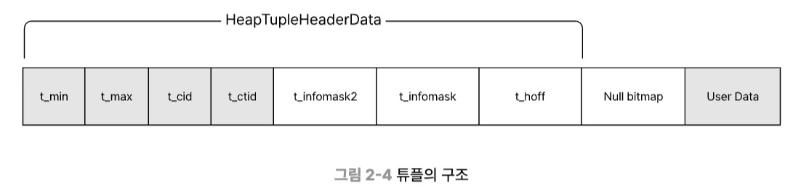
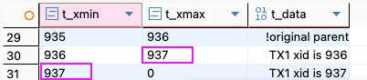
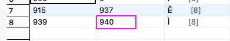
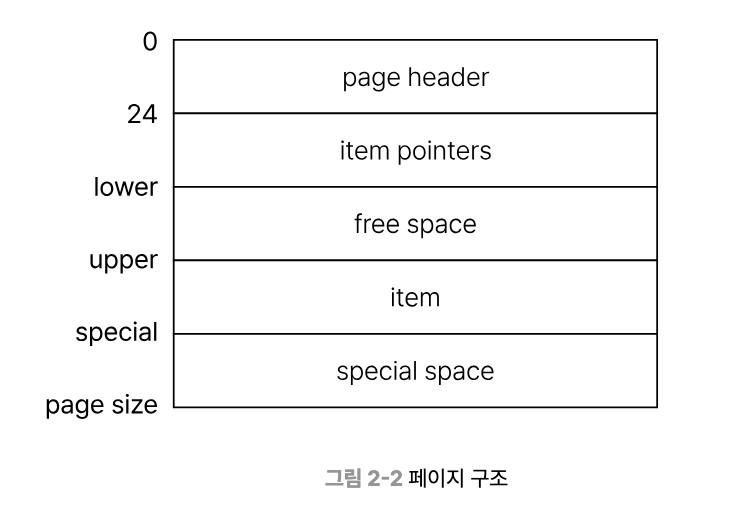

# 스냅샷과 트랜잭션 가시성

---

## 1. 스냅샷

스냅샷은 하나의 튜플에 대해 **버전별로 여러 튜플을 관리**하는 것을 말한다.

### a) 튜플 구조

튜플은 **튜플 헤더**(메타 정보)와 **User Data**(실제 데이터) 영역으로 나뉜다.



| 필드 | 설명 |
|---|---|
| `t_xmin` | 이 튜플을 생성(INSERT, UPDATE)한 트랜잭션 ID |
| `t_xmax` | 이 튜플을 수정/삭제(UPDATE, DELETE)한 트랜잭션 ID. INSERT 시에는 0 |
| `t_ctid` | 이 튜플의 물리적 위치 `(페이지 번호, 슬롯 번호)`. 새 버전이 생기면 그 버전의 위치로 업데이트됨 (직전 버전만 변경) |
| `t_infomask` | `t_xmin`의 커밋 여부 힌트 제공. 다른 트랜잭션이 `XMIN_COMMITTED` 등을 마킹 |

MVCC에 따라 튜플은 입력/변경될 때마다 새로운 버전을 만들어 저장한다.
→ 하나의 논리적 row가 여러 물리적 튜플 버전을 가질 수 있다.

---

**INSERT:**

새 튜플 1개를 추가한다.

```
새 튜플: xmin=xid(cur), xmax=0, t_ctid=위치(cur), data=(new)
```

---

**UPDATE:** 직전 튜플 수정 + 새 튜플 추가

```
직전 튜플 수정: xmin=xid(old), xmax=xid(cur), t_ctid=위치(cur), data=(old)
새 튜플 추가:   xmin=xid(cur), xmax=0,         t_ctid=위치(cur), data=(new)
```



---

**DELETE:** 직전 튜플의 xmax만 수정

```
직전 튜플 수정: xmin=xid(old), xmax=xid(cur), t_ctid=위치(cur), data=(old)
```



---

**정리:**

| 연산 | 직전 튜플 변경 | 새 튜플 추가 |
|---|---|---|
| INSERT | X | O (`xmax=0`) |
| UPDATE | O (`xmax`, `t_ctid` 수정) | O |
| DELETE | O (`xmax` 수정만) | X |

---

### b) 스냅샷 구성

스냅샷은 다음 3가지로 구성된다.

| 필드 | 설명 |
|---|---|
| `xmin` | 가장 오래된 활성 트랜잭션 ID. 이보다 낮은 XID는 모두 커밋된 상태 |
| `xmax` | 다음에 할당될 트랜잭션 ID. 이 이상의 XID는 아직 시작되지 않은 상태 |
| `xip_list` | 현재 진행 중인 트랜잭션 ID 목록 (가상 트랜잭션 제외) |

**격리 수준별 스냅샷 생성 시점:**

| 격리 수준 | 스냅샷 생성 시점 |
|---|---|
| **Read Committed** | 매 쿼리마다 새로 생성 |
| **Repeatable Read** | 트랜잭션의 첫 쿼리에서 한 번만 생성 후 유지 |
| **Serializable** | 트랜잭션의 첫 쿼리에서 한 번만 생성 + 트랜잭션 간 의존성 그래프 추적 |

---

## 2. 트랜잭션 가시성

스냅샷에서 튜플이 보이는 범위. **트랜잭션 시작 시점**과 **커밋 여부**에 따라 결정된다.

### a) 최신 튜플을 찾는 과정

페이지 구조:

- `item pointers`: item(tuple)을 가리키는 포인터
- `item(= tuple)`: 실제 데이터

탐색 경로: `TID → itemid → tuple`



SELECT 쿼리 발생 시 탐색 흐름:

```
1. 인덱스 → ctid로 튜플 위치 찾아감
2. 각 튜플마다:
   - xmin의 CLOG/infomask 확인
     → aborted  → 체인 종료, 반환 없음
     → in-progress → 안 보임, 다음 체인으로
     → committed → xmax 확인 (MVCC visible 판별)
       → visible   → ✅ 반환
       → invisible → t_ctid 따라 다음 버전으로 이동
3. t_ctid가 자기 자신이면 체인 끝
```

- `t_ctid`가 현재 위치와 동일할 때까지 반복 → **HOT chain (Heap Only Tuple chain)**
- MVCC visible 판별 시 `infomask hint bits` 먼저 확인
  - "커밋됨" 표시가 있으면 CLOG 조회 없이 바로 판단
  - 표시가 없으면 CLOG를 조회하고 결과를 infomask에 기록

> **CLOG**: 각 트랜잭션 ID의 커밋 여부를 기록하는 파일. 조회 비용이 크기 때문에 infomask로 캐싱해 반복 조회를 줄인다.

---

### b) MVCC visible 판정

각 튜플마다 순서대로 판정한다.

**Step 1. `xmin` 커밋 여부 확인**

infomask 또는 CLOG를 조회한다. rollback(aborted)됐다면 다음 체인으로 이어간다.

**Step 2. `xmin`이 스냅샷 범위 안인지 확인**

아래 조건을 **모두** 만족할 때 변경사항이 보인다.

```
snapshot.xmin ≤ tuple.xmin < snapshot.xmax
AND
tuple.xmin이 snapshot.xip_list에 없을 것 (= 이미 커밋된 상태)
```

**Step 3. `xmax`로 삭제 여부 판별**

| xmax 상태 | 의미 | 가시성 |
|---|---|---|
| `0` | 커밋된 INSERT 또는 UPDATE의 최신 버전 | ✅ 보임 |
| `xip_list`에 있음 | UPDATE/DELETE 진행 중. 아직 이전 값이 유효 | ✅ 보임 |
| `xip_list`에 없음 | 커밋된 DELETE | ❌ 안 보임 |
