# 0326(목) - Tomcat, JPA 메커니즘

---

# Part 1. Tomcat

Tomcat으로 성능 튜닝을 할 수 있다.

**Spring 요청 흐름:**

```
Client → Tomcat(WAS) → DispatcherServlet → Controller → Service → Repo → DB
```

**Tomcat 내부 요청 처리 흐름:**

```
                  ┌────────────────────────────────────────────┐
Client →          │  Acceptor → Poller → Worker Thread         │
        ↑         │                           ▼                │
      (응답)       │  [Tomcat]       (Http11Nio)Processor       │
        |         │                           ▼                │
        |         │                     CoyoteAdapter          │
        |         └───────────────────────────┼────────────────┘
        |         ┌───────────────────────────▼────────────────┐
        |         │  [Spring]         DispatcherServlet        │
        |         │                           ▼                │
        |         │                    HandlerMapping          │
        |         │                           ▼                │
        |         │              Controller / Service / Repo   │
        |         └───────────────────────────┼────────────────┘
        └─────────────────────────────────────┘
```

| 단계 | 담당 | 역할 |
|---|---|---|
| **0** | OS 커널 | 클라이언트와 TCP 연결 수립, Connected Socket 생성 |
| **1** | Acceptor | Accept Queue에서 소켓을 꺼내 Poller에 전달 |
| **2** | Poller | 소켓을 감시하다가 HTTP 요청이 들어오면 Worker에 전달 |
| **3** | Worker | HTTP 파싱, Spring 코드 실행, 응답 반환 |

---

## 0) 서버-클라이언트 연결 수립

```
Client → SYN     → Server  # 요청
Client ← SYN-ACK ← Server  # 응답
Client → ACK     → Server  # 연결 (ESTABLISHED)
```

1. 클라이언트가 8080 포트와 TCP 3-Way Handshake로 `ESTABLISHED` 연결 수립
2. 커널이 **Connected Socket** 생성 → 리스닝 소켓의 **Accept Queue**에 저장
3. 애플리케이션(Acceptor)의 수락 대기

> **Connected Socket**: 클라이언트와 1:1 통신 전용 소켓

---

## 1) Acceptor

커널의 TCP Accept Queue에서 연결을 꺼내 Poller에 넘기는 역할.

**처리 흐름:**

1. OS 커널이 3-Way Handshake 완료 후 Connected Socket 생성
2. Accept Queue에서 대기
3. `countUpOrAwaitConnection()` 체크
   - 현재 연결 수 < `maxConnections` → `accept()` 호출
   - 현재 연결 수 = `maxConnections` → **블로킹 대기** (서버가 더 이상 요청을 받지 않음)
4. `accept()` 호출 → Connected Socket의 **fd(파일 디스크립터)** 수령 → `SocketChannel` 객체 생성
5. `SocketWrapper`로 감싸 → `PollerEvent`로 변환 → Poller의 EventQueue에 전달

---

무한 루프로 `serverSocketAccept()`를 계속 호출한다. (스레드 1~2개, 1:N NIO 구조)

```java
// Acceptor.java
while (!stopCalled) {
    socket = endpoint.serverSocketAccept();  // non-blocking
}
```

Accept Queue에서 받아오는 것은 Connected Socket의 **fd**다. 이를 `SocketChannel` 객체로 래핑한다.

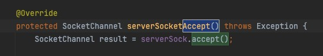

빈 fd를 준비해서 `implAccept`를 통해 OS로부터 받아온다. 이것이 `SocketChannel`이 된다.

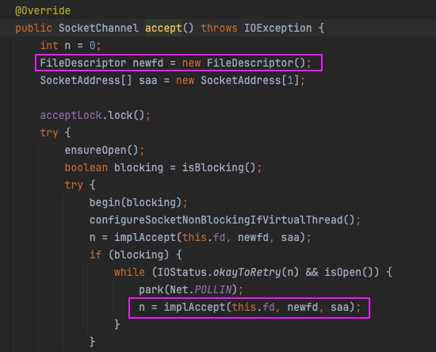

연결이 성공하면 `SocketChannel`을 `SocketWrapper`로 감싸 Poller에 전달한다.

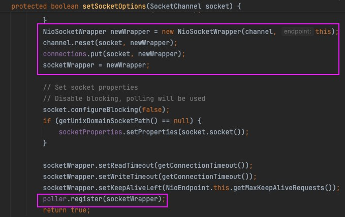

`poller.register()` 내부에서 `PollerEvent` 객체로 변환되어 Poller의 EventQueue에 들어간다.

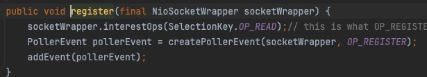

Connected Socket이 `maxConnections`(보통 8192)에 도달하면 `accept()`를 호출하지 않고 블로킹 대기한다. 빈자리가 생기면 커널이 스레드를 깨워 대기 중인 연결을 처리한다.

---

## 2) Poller

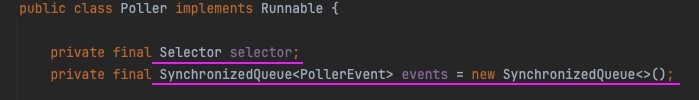

Acceptor가 EventQueue에 넣어준 소켓을 감시하며 I/O 이벤트를 감지한다.

| 구성 요소 | 설명 |
|---|---|
| `EventQueue` | `SynchronizedQueue<PollerEvent>` |
| `Selector` | 끊임없이 I/O 이벤트를 감지하는 역할 |
| 감시 대상 | 소켓에 HTTP 요청 데이터가 들어오는지 여부 |

**처리 흐름:**

1. Acceptor → EventQueue에 `PollerEvent(OP_REGISTER)` 추가
2. `Poller.events()` → 큐에서 꺼냄 → `OP_REGISTER` 확인
3. 소켓을 Selector 감시 목록에 등록: `sc.register(selector, OP_READ)`
4. `selector.select()` → JVM이 OS `epoll_wait()` 호출 → 이벤트 대기 (무한루프)
5. 이벤트 감지 → `processKey()` → Worker에 소켓 전달

> `OP_REGISTER`: Tomcat 내부 커스텀 상수. "새 소켓 등록해줘"
> `OP_READ`: Java NIO 표준. "읽을 데이터 오면 알려줘"

---

**Selector와 epoll:**

```
Poller → Selector.select() → JVM 내부에서 epoll_wait() 호출
```

| 개념 | 설명 |
|---|---|
| `Selector` | Java NIO 객체. 여러 채널의 I/O 이벤트 탐지. Tomcat은 소켓 채널의 I/O를 탐지 |
| `epoll` | OS 영역의 I/O 이벤트 감지 메커니즘 |

Selector는 무한 루프로 `select()`를 호출해 I/O를 감지한다.

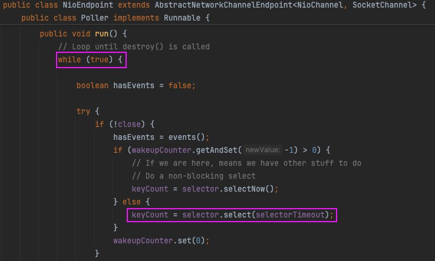

루프 안에서 소켓에 데이터가 들어왔다는 이벤트가 감지되면 Worker에 넘긴다.

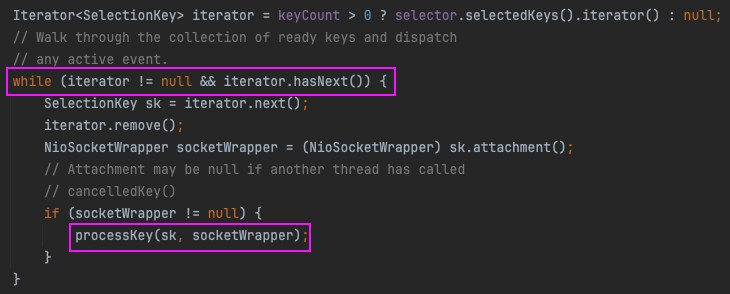

---

**BIO vs NIO:**

| 방식 | 구조 | 문제점 |
|---|---|---|
| **BIO** (Blocking I/O) | 소켓 1개 : 스레드 1개 | 소켓이 해제돼야 스레드를 반환 → **스레드 자원 고갈** |
| **NIO** (Non-blocking I/O) | 소켓 N개 : 스레드 1개 | - |

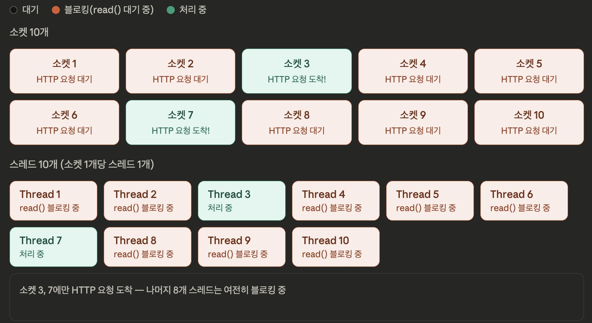

NIO는 N개의 소켓을 스레드 1개로 담당할 수 있다. `maxConnections`가 10,000개라도 Poller 스레드는 1~2개면 충분하다.

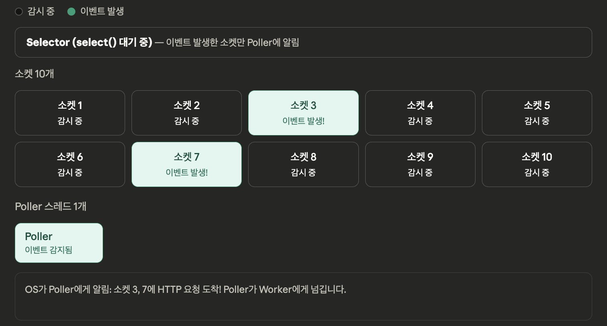

---

## 3) Worker (Executor)

Poller로부터 소켓을 받아 실제 요청을 처리하는 스레드.

**처리 흐름:**

1. 소켓에서 데이터를 읽는다 (`read`)
   - 커널 메모리의 Connected Socket Receiver 버퍼 → 유저 가상 메모리로 복사
2. `Http11NioProcessor`로 HTTP 프로토콜 파싱 → Servlet/Spring Controller 코드 실행
3. 로직 처리 완료 후:
   - **Keep-Alive인 경우**: 소켓을 다시 Poller에 반환
   - **그 외**: 연결 종료

**Tomcat 튜닝 (yaml):**

```yaml
server:
  port: 8080
  tomcat:
    accept-count: 500        # 백로그 큐 크기
    max-connections: 10000   # 최대 연결 수
    threads:
      max: 10                # 최대 워커 스레드 수. 늘리면 컨텍스트 스위칭 비용 발생
      min-spare: 5           # 유지 워커 스레드 수
    acceptor-thread-count: 10
    connection-timeout: 60000
```

> **Worker Thread를 무한정 늘리면 안 되는 이유:**
> DB 커넥션 수에 한계가 있다. Thread만 늘리면 DB 병목이 생겨 응답 지연이 발생한다.
> Tomcat과 DB를 함께 튜닝해야 처리량이 실질적으로 증가한다.

- Tomcat의 기본 Worker Thread 수: **200개**
- HTTP 요청 단위로 Worker Thread가 동작 → 하나의 Thread 안에서 트랜잭션이 여러 개 생성 가능 → EntityManager, 영속성 컨텍스트도 그만큼 생성 → **JVM Heap 사용량 증가**

---

## 정리

| 역할 | 담당 | 핵심 |
|---|---|---|
| 연결 수락 | Acceptor | Accept Queue에서 소켓을 꺼내 Poller에 전달 |
| I/O 감시 | Poller | Selector(epoll)로 N개 소켓을 1~2개 스레드로 감시 |
| 요청 처리 | Worker | HTTP 파싱, Spring 코드 실행, 응답 반환 |

- **관심사 분리**로 자원 효율 극대화
- **NIO 구조** 덕분에 수천 개의 연결을 단 몇 개의 스레드로 관리
- Worker Thread가 부족해도 Acceptor·Poller는 계속 동작 → **안정성 확보**

---

---

# Part 2. JPA 메커니즘

JPA와 Hibernate가 **1차 캐시(영속성 컨텍스트)**를 담당한다.

```
EntityManagerFactory / EntityManager
    └── 영속성 컨텍스트 관리
            └── 엔티티 스냅샷 저장 및 관리

트랜잭션 & flush → DB에 쿼리 전송 → commit or rollback
```

---

## a) EntityManagerFactory

> 비용이 매우 큰 무거운 객체. 애플리케이션 로딩 시점에 **딱 하나만** 생성된다.

구현체: Hibernate의 `SessionFactory`

**하는 일:**

1. `EntityManager` 생성 (공장 역할)
2. `persistence.xml` 기반으로 메타데이터 파싱 및 DB 커넥션 풀 초기화
   - 어떤 엔티티가 어떤 테이블인지
   - 컬럼 매핑 정보
   - 연관관계 정보
3. 엔티티 매핑 정보 관리

---

## b) EntityManager와 영속성 컨텍스트

구현체: Hibernate의 `SessionImpl`

`EntityManager`가 영속성 컨텍스트를 **1:1로 관리**한다.

내부에 영속성 컨텍스트가 `StatefulPersistenceContext`로 구현되어 있다.

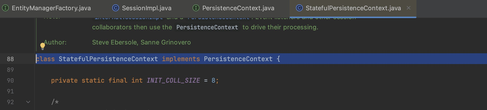

영속성 컨텍스트 내부의 **1차 캐시**에 엔티티와 스냅샷이 저장된다.

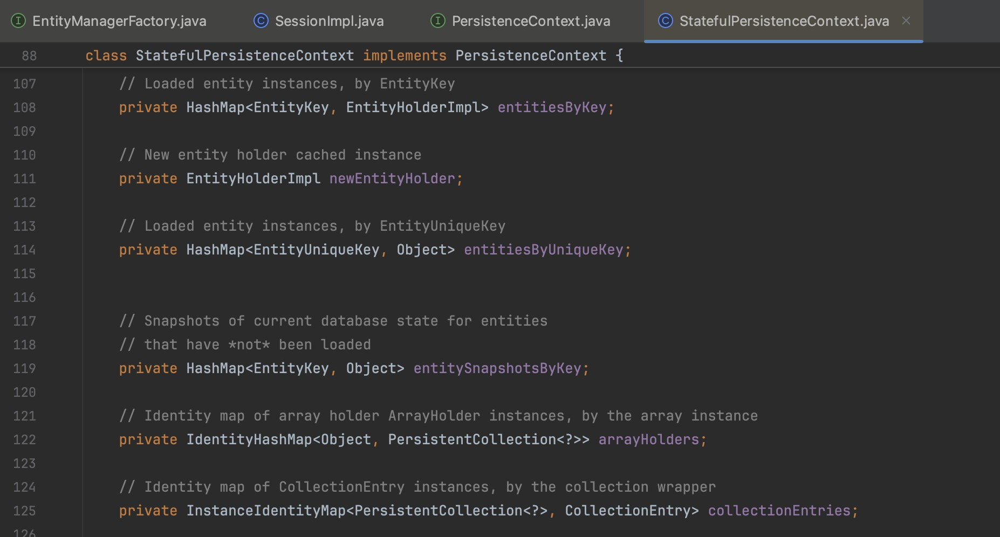

> JPA는 스냅샷과 엔티티를 비교하여 **Dirty Checking**을 수행한다.

---

## c) 영속성 컨텍스트의 생명주기

트랜잭션 시작 시 EntityManager가 생성되고, 트랜잭션 종료 시 GC에 의해 정리된다.
단, **OSIV(Open Session In View)** 설정에 따라 달라진다.

| OSIV | 영속성 컨텍스트 생존 범위 | DB Connection 반환 시점 |
|---|---|---|
| **true** | 트랜잭션 종료 후에도 HTTP 요청이 끝날 때까지 유지 | 요청 종료 후 |
| **false** | `@Transactional` 종료 시 즉시 GC 대상 | 트랜잭션 종료 시 |

```yaml
# 권장 설정
open-in-view: false
```

> **DB Connection은 소켓**이다. 언제 반환하느냐에 따라 실제 DB에 접근 가능한 스레드 수가 달라진다. 성능에 직결된다.

---

**Worker Thread와 영속성 컨텍스트:**

- `TransactionSynchronizationManager` → ThreadLocal로 스레드별 영속성 컨텍스트 관리
- 하나의 Worker Thread 안에서 여러 트랜잭션이 생성될 수 있다 → 그만큼의 EntityManager, 영속성 컨텍스트 생성 → **JVM Heap 사용량 증가**

**`@Async` + 트랜잭션:**

새로운 스레드가 생성되므로 영속성 컨텍스트도 별도로 생성된다.

```
# 로그 예시

# 기존 트랜잭션 중단, 새 트랜잭션 시작
Suspending current transaction, creating new transaction with name [... MemberPointService.changeAllUserData]

# 새 트랜잭션 종료 후 기존 트랜잭션 재개
Resuming suspended transaction after completion of inner transaction
```

`REQUIRES_NEW` 발생 시: 기존 트랜잭션(tx1) **suspend** → 새 트랜잭션(tx2) 시작 → tx2 종료 → tx1 **resuming**

---

## d) Entity 생명주기

| 상태 | 설명 |
|---|---|
| **Transient** | 아직 영속화되지 않은 상태. `save()` 하지 않은 새 객체 |
| **Managed** | 영속성 컨텍스트가 관리하는 상태. 변경 추적 대상 |
| **Detached** | 영속성 컨텍스트에서 관리했으나 현재는 분리된 상태 |
| **Removed** | 삭제 예정 객체 |

---

## 전체 구조 정리

JVM 프로세스 안에서 모든 것이 동작한다.

```
JVM
 ├── 커널로부터 메모리·스레드 할당
 ├── Tomcat 스레드 (Acceptor, Poller, Worker)
 │    └── Worker Thread 1개당 N개의 영속성 컨텍스트 관리
 ├── JPA (Hibernate)
 │    ├── HikariCP ←TCP/IP→ DB
 │    └── 영속성 컨텍스트 (1차 캐시, 스냅샷)
 └── OSIV 설정에 따라 DB Connection 반환 시점 결정
```

- `REQUIRES_NEW` 발생 시 tx1 suspend → tx2 시작 → tx2 종료 → tx1 resuming
- 영속성 컨텍스트와 DB Connection의 반환 시점이 **OSIV 설정**에 따라 달라지며, 이것이 성능에 직결된다.
