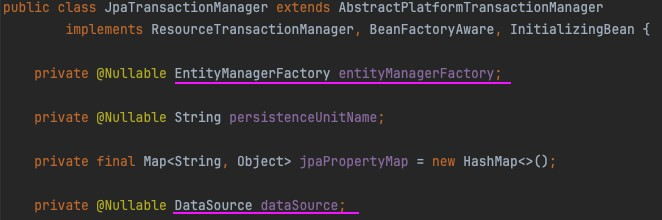

# 0327(금) - Spring Transaction 심화, 모듈화

---

## 1. PlatformTransactionManager

> 트랜잭션의 시작·커밋·롤백을 표준 인터페이스로 추상화한 것.
> `BEGIN`, `COMMIT`, `ROLLBACK`을 일일이 작성해야 하는 번거로움을 줄이고, 중첩 트랜잭션을 가능하게 한다.

### a) 인터페이스와 구현체

```java
public interface PlatformTransactionManager extends TransactionManager {
    TransactionStatus getTransaction(@Nullable TransactionDefinition definition);
    void commit(TransactionStatus status);
    void rollback(TransactionStatus status);
}
```

구현체: `JpaTransactionManager` (그 외 JDBC, JTA 등)



구현체 내부에 `EntityManagerFactory`와 `DataSource`가 있다.

| 구성 요소 | 역할 |
|---|---|
| `EntityManagerFactory` | EntityManager, 영속성 컨텍스트 관리 |
| `DataSource` | DB 연결 관리 ([→ HikariCP 참고](#a-hikaricp)) |

---

### b) 트랜잭션 시작과 커넥션 점유

```
1. 메서드 호출
2. TransactionInterceptor (AOP 프록시) 개입 → PlatformTransactionManager 호출
3. PlatformTransactionManager.getTransaction() → 트랜잭션 시작
4. HikariPool.getConnection() → 커넥션 요청
5. connection.setAutoCommit(false) → 격리 수준 적용
6. Connection을 ThreadLocal에 저장 → 동기화
```

> `@Transactional`은 AOP(프록시) 방식으로 동작한다.
> 앱 시작 시 Spring이 어노테이션 감지 → 프록시로 감싼 객체를 Bean으로 등록.

> Thread마다 트랜잭션을 여러 개 수행할 수 있다.
> 하나의 물리적 트랜잭션 내에서 동일한 커넥션을 재사용하도록 `ThreadLocal`에 저장해두고 꺼내 쓴다.

---

### c) 트랜잭션 종료와 자원 반납

**정상 종료 (commit):**
1. `connection.commit()` 호출
2. DB 엔진이 디스크에 반영
3. `connection.setAutoCommit(true)` → 상태 복구
4. `connection.close()` → HikariCP에 커넥션 반납

**예외 발생 (rollback):**
1. `connection.rollback()` 호출
2. 상태 복구 및 커넥션 반납

---

## 2. 트랜잭션 전파 옵션

트랜잭션을 생성할지, 기존 것에 참여할지 방법을 정의한다.

**물리 트랜잭션 vs 논리 트랜잭션:**
- 하나의 **물리 트랜잭션** 안에 있는 논리 트랜잭션들은 `ThreadLocal`을 통해 **같은 Connection을 재사용**한다.
- 물리 트랜잭션이 분리되면 그만큼 Connection이 추가로 필요하다.
  → `suspend(connection)`으로 `ThreadLocal`에 저장 후 HikariCP에서 새 커넥션을 받아온다.
  → 분리된 트랜잭션 종료 후 커넥션을 반납하고, 기존 커넥션을 재사용한다.

---

| 옵션 | 동작 | 비고 |
|---|---|---|
| **REQUIRED** | 기존 트랜잭션이 있으면 참여, 없으면 새로 생성 | 기본값 |
| **REQUIRES_NEW** | 항상 새로운 물리 트랜잭션 생성. 기존 트랜잭션은 suspend | ⚠️ 데드락 위험, 커넥션 풀 고갈, 네트워크 I/O 2회 발생 |
| **SUPPORTS** | 기존 트랜잭션이 있으면 참여, 없으면 트랜잭션 없이 실행 | 거의 안 씀 |
| **NOT_SUPPORTED** | 트랜잭션 없이 실행. 기존 트랜잭션 suspend | Spring Event 이후로 잘 안 씀 |
| **MANDATORY** | 기존 트랜잭션이 반드시 있어야 함. 없으면 예외 발생 | 거의 안 씀 |
| **NEVER** | 트랜잭션 없이 실행. 있으면 예외 발생 | - |
| **NESTED** | 중첩 트랜잭션 생성 (세이브포인트 사용) | 부분 롤백 필요 시. PostgreSQL/Oracle 지원, MySQL InnoDB 제한적 |

---

**REQUIRED 로그 예시:**
```
-- 물리 트랜잭션 생성 (부모)
Opened new EntityManager [SessionImpl(173722996<open>)] for JPA transaction

-- findAll이 논리 트랜잭션으로 참여 (자식)
Participating in existing transaction
select m1_0.id, m1_0.email, m1_0.password from members m1_0
```

**REQUIRES_NEW 로그 예시:**
```
-- 물리 트랜잭션 생성 (부모)
Opened new EntityManager [SessionImpl(208160462<open>)] for JPA transaction

-- 부모 트랜잭션 suspend, 새 물리 트랜잭션 생성 (자식)
Suspending current transaction, creating new transaction with name [... MemberPointService.changeAllUserData]
Opened new EntityManager [SessionImpl(770701085<open>)] for JPA transaction

-- 자식 트랜잭션 종료 후 부모 재개
Resuming suspended transaction after completion of inner transaction
```

---

## 3. @Transactional 옵션

### a) isolation

격리 수준 설정. [→ 격리 수준별 스냅샷 생성 시점 참고](../0324/0324.md#d-스냅샷)

---

### b) timeout

초 단위 설정. 기본값 `-1` (제한 없음). 부모 트랜잭션의 timeout을 변경해야 한다.
데드락 방지, 배치 작업 시간 제한 등에 사용한다.

```
-- 예외 예시
TransactionTimedOutException: Transaction timed out: deadline was Fri Mar 27 11:06:23 KST 2026
```

---

### c) readOnly

읽기 전용 트랜잭션으로 설정 시 아래 3단계 최적화가 활성화된다.

**1. JDBC 드라이버 / DB 엔진 최적화**

`connection.setReadOnly(true)` 호출 → DB·드라이버까지 전파

- DB 엔진: Undo 로그 생성 생략
- CQRS 환경: Master-Slave에서 Slave(Read-only DB)로 쿼리 자동 라우팅

**2. JVM 메모리 최적화**

| 모드 | 메모리 점유 |
|---|---|
| 일반 | 엔티티 객체 + 스냅샷 복사본 → **2배** |
| ReadOnly | 엔티티 객체만 존재. 스냅샷 로드 즉시 삭제 → GC 부담 감소, 처리량 증가 |

**3. JPA / Hibernate 최적화**

- **Dirty Checking 비활성화**: 스냅샷이 즉시 삭제되므로 비교 대상 없음
- **FlushMode.MANUAL**: `flush()` 자동 호출 안 함

> **JPQL/Querydsl에서 DTO를 직접 반환할 때도 `readOnly=true`를 명시해야 하는 이유:**
> DTO는 영속성 컨텍스트를 사용하지 않아 2·3번 최적화 효과는 없지만,
> **1번(JDBC 드라이버/DB 엔진 최적화)** 을 받기 위해 명시하는 것이 좋다.

**용어 정리:**
- **Dirty Checking**: 영속성 컨텍스트 내 엔티티를 스냅샷과 비교하여 변경사항 감지. `O(N)`
- **flush**: Dirty Checking → 변경된 것만 SQL 생성 → DB에 전송

---

### d) rollback

기본 동작: `RuntimeException(Unchecked)` 및 JVM `Error` 발생 시 롤백. `Checked Exception`은 기본적으로 커밋.

| 옵션 | 설명 |
|---|---|
| `rollbackFor` | 롤백할 예외 클래스 지정 (기본: RuntimeException) |
| `noRollbackFor` | 롤백 제외할 예외 클래스 지정 |
| `rollbackForClassName` | 클래스명 문자열로 지정 |
| `noRollbackForClassName` | 클래스명 문자열로 제외 지정 |

**Checked vs Unchecked:**

| 구분 | 특징 | 예시 | 기본 롤백 |
|---|---|---|---|
| **Checked** | 컴파일러가 try-catch 또는 throws 강제 | IOException, FileNotFoundException | ❌ (커밋) |
| **Unchecked** | 컴파일러 확인 없음. 런타임에 발생 | RuntimeException, NullPointerException | ✅ |

> Unchecked는 예측하지 못한 실수 → 무조건 롤백이 안전하다.
> Checked는 예상 가능한 상황 → 개발자의 판단이 필요하므로 기본적으로 커밋된다.

**롤백 처리 순서:**
```
1. 프록시 객체(CGLIB)가 예외 가로챔
2. TransactionInterceptor.invoke() 호출
3. TransactionInterceptor가 rollbackOn() 호출
4. RuntimeException 또는 Error이면 PlatformTransactionManager.rollback() 호출
```

---

## 4. @TransactionalEventListener

다른 Worker Thread로 로직 수행을 옮겨 **유저 응답 시간을 최적화**하기 위해 사용한다.

> `NOT_SUPPORTED`만으로는 부족하다.
> 같은 Worker Thread에서 실행되기 때문에 응답 반환 시간을 줄이지 못한다.

### a) 사용법

**1. 이벤트 객체 생성**

```java
@Getter
@AllArgsConstructor
public class MemberSignUpEvent {
    private final Long id;
    private final String email;
}
```

**2. 이벤트 리스너 생성**

`@Async`로 스레드를 분리하고, `phase` 옵션으로 실행 시점을 설정한다.
`Application.java`에 `@EnableAsync`도 함께 달아야 한다.

```java
@Component
public class MemberSignUpEventListener {

    @Async  // 별도 스레드에서 실행
    @TransactionalEventListener(phase = TransactionPhase.AFTER_COMMIT)  // 커밋 후 실행
    public void handle(MemberSignUpEvent event) {
        // 이메일 발송 등
    }
}

@EnableAsync
@SpringBootApplication
public class Application { ... }
```

**3. 이벤트 발행**

```java
@Service
@RequiredArgsConstructor
public class MemberService {

    private final ApplicationEventPublisher eventPublisher;

    @Transactional
    public void signUp(Member member) {
        memberRepository.save(member);
        eventPublisher.publishEvent(new MemberSignUpEvent(member.getId(), member.getEmail()));
        // 트랜잭션 커밋 후 리스너 실행
    }
}
```

**로그 확인:** `nio-8080-exec-2` → `task-1`로 다른 스레드로 넘겨진다.

```
[nio-8080-exec-2] o.s.orm.jpa.JpaTransactionManager: Closing JPA EntityManager after transaction
[         task-1] c.e.m.event.MemberSignUpListener : member ID = 15
```

---

### b) 코드 강결합 해소

`publishEvent()`는 반환값을 받지 않아도 된다.
→ 변경 지점(사이드 이펙트)이 작아져 **유지보수성이 높아진다.**

---

## 5. 아키텍처 모듈화

### a) 왜 모듈화가 필요할까?

서비스가 커지면 두 가지 문제가 발생한다.

**1. 코드 결합도 증가**

하나의 기능을 수정하려면 Controller, Service, Repository, Entity 등 최소 5개 이상의 클래스를 함께 수정해야 한다. 전체 구조를 파악하기 어렵고 유지보수가 힘들다.

**2. 도메인 간 경계 없음**

```
userService    → orderRepository  (직접 호출)
paymentService → userRepository   (직접 호출)
```

도메인 간 직접 호출이 쌓이면 순환 의존·강결합이 생겨 수정 시 연쇄 영향이 발생한다.

→ **모듈화 전략**: 도메인 중심 구조, 의존성 방향 통제, 변경 범위 최소화

---

### b) 스프링 모듈화 전략

**1. Layered Architecture (기본)**

기술 기준으로 레이어를 나눈다. 모듈 간 응집도 낮고 결합도 증가.

| 레이어 | 역할 |
|---|---|
| Presentation | HTTP 요청 처리 |
| Business | 비즈니스 로직 수행 |
| Persistence | DB 작업 수행 |

**2. 도메인 기반 모듈화** (실무 적합)

도메인 단위로 패키지를 구성. 각 도메인이 자신의 Controller·Service·Repository·Entity를 가진다.

---

## 6. 기타 메모

### a) HikariCP

> Connection Pool 관리 역할 (`HikariPool.java`)

- `Connection`: JDBC 인터페이스. DB 통신을 추상화한 것. 구현체 내부에 DB와 연결된 **소켓**이 있고, 이를 통해 네트워크 I/O가 진행된다.
- `PlatformTransactionManager`가 트랜잭션을 열고 커넥션을 요청할 때, HikariCP가 Pool 상태를 보고 커넥션을 주거나 대기시킨다.

```java
DataSource.getConnection()  // 커넥션 요청 → HikariCP 동작
```

트랜잭션 병목은 HikariCP가 관리하는 **Connection 개수**에 따라 발생할 수 있다.
→ 성능 튜닝 시 **PostgreSQL 인덱스·쿼리 / Tomcat / HikariCP**를 함께 튜닝해야 시너지가 극대화된다.

```yaml
hikari:
  connection-timeout: 30000
  maximum-pool-size: 1000  # 동시 DB 통신 가능 수
  minimum-idle: 5
  idle-timeout: 600000
  max-lifetime: 1800000
  auto-commit: true
```
