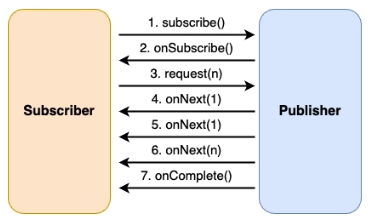

## 1. Reactive streams

비동기 스트림 처리, 즉 연속된 데이터를 처리할 때 발생하는 백프레셔 문제를 해결하기 위해 탄생한 표준.

- 적은 스레드로 수만 개 동시 연결 처리(I/O 대기 동안 스레드가 놀지않고 다른 일을 수행)
- 백프레셔 제어 매커니즘으로 **OutOfMemoryError(=**OOM) 방지
- 스트림 처리 연산자를 조합해 비동기 데이터 흐름을 선언형으로 작성 가능

### a) 백프레셔 문제

생산자가 데이터를 보내는 속도가 소비자가 처리하는 속도보다 빠를 때 발생한다.

#### 문제 — Observer Pattern(Push-only):

이벤트 발생 시 여러 객체에 알리는 패턴. Observer는 데이터를 받기만 하기때문에 백프레셔 문제가 발생한다. 처리 못한 데이터는 메모리에 계속해서 쌓이며 OOM을 일으킬 수 있다.

- Subject(= Publisher): 이벤트를 발생시키는 쪽. 관찰 대상
- Observer(= Subscriber): 이벤트를 받는 쪽. 관찰자

#### 해결 — Reactive Streams(Push-Pull 하이브리드):

백프레셔 제어를 통해 시스템 안정성을 확보한다(OOM 방지). 대용량 데이터 스트림 처리에 적합하다.

- request(n)으로 소비자가 속도를 조절해서 데이터를 받는다.

> Pull 모델인 Iterator은 동기 방식이기 때문에 비동기+논블로킹+흐름제어가 필요한 곳에서는 Reactive Streams가 적합하다.
>

### b) 전체 구조

4개의 인터페이스로 구성돼있다.

```java
// 데이터를 생산
public interface Publisher<T> {
    void subscribe(Subscriber<? super T> subscriber);
}

// 데이터를 소비
public interface Subscriber<T> {
    void onSubscribe(Subscription subscription);
    void onNext(T item);
    void onError(Throwable throwable);
    void onComplete();
}

// 생산자-소비자 사이의 연결고리(구독 관계 제어)
public interface Subscription {
    void request(long n);
    void cancel();
}

// 생산자이자 소비자 (중간 처리용)
public interface Processor<T, R> extends Subscriber<T>, Publisher<R> {
}
```

#### Processor:

Subscriber + Publisher 둘 다 되는 것. 데이터를 받아서 → 변환/필터링 → 다음으로 전달한다.

Proccesor가 없으면 다음과 같이 구현해야한다.

```java
// Publisher (데이터 생산)
Flux<String> rawData = Flux.just("apple", "banana", "cherry");

// Subscriber (데이터 소비)
rawData.subscribe(data -> {
    // 여기서 반환 및 처리
    String upper = data.toUpperCase();
    System.out.println(upper);
});
```

Proccesor가 있어 연산자 체이닝이 가능하다.

```java
Flux.just("hello", "world", "java")   // Publisher (원본)
    .map(s -> s.toUpperCase())         // Processor 1: String → String
    .filter(s -> s.length() > 4)       // Processor 2: String → String
    .map(s -> s.length())              // Processor 3: String → Integer
    .subscribe(System.out::println);   // Subscriber (최종)
```

### c) 동작 흐름



1. `subscribe(subscriber)` : 소비자가 생산자에 구독 신청
2. `onSubscribe(subscription)` : 구독 수락(연결고리 전달)
3. `request(n)` : n개 요청
4. `onNext(data1) ... onNext(dataN)` : 데이터 전달

   ***→ 요청한 개수(n) 이상의 데이터를 절대 보내지 않음으로써 백프레셔가 보장된다.***

5. request가 없으면 Publisher는 대기
6. `request(n), onNext(...)` 반복
7. `onComplete()` : 끝, `onError(exception)` : 에러 발생

### d) 구현체

| **스펙** | **Reactor** | **RxJava 2+** |
| --- | --- | --- |
| Publisher | Flux/Mono | Flowable |
| Subscriber | BaseSubscriber | Subscriber |
| - | - | Observable (백프레셔 X) |

---
